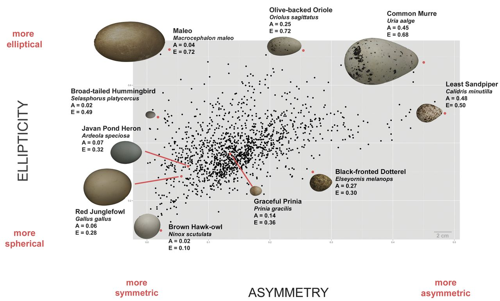

```{r setup, include=FALSE}
knitr::opts_chunk$set(echo = TRUE)
pacman::p_load(tidyverse, rptR)
```

## Motivation

We had seen Cassie Stoddard's 2017 Science paper on variation in avian egg shape across a huge range of species [@stoddard17]. She measured anywhere from just a few up to a few hundred eggs from each species using a custon MatLab program from museum pictures. While there are some full clutches measured, all of the analyses are based on species mean values rather than any comparison of multiple eggs produced by the same individual. She ends up concluding that the most variation in egg shape (albeit, not that large a % of variation) is explained by flight distances and time spent flying. The striking figure from the paper is figure 1 that shows the full variation of egg shape in morphospace plotted as the degree of asymmetry (pointiness on one end vs round on the other) vs. ellipticity (elongation). Here is the figure from her paper: 

\


In the figure, each species is one point, but as we were doing cross fosters of eggs in 2019, we were noticing that there seemed to be a huge amount of variation in egg shape between different tree swallows and that it seemed to span a lot of the variation in Cassie's paper. Just for fun, we started taking photos of each full clutch of eggs from 2019 & 2020 and I got in touch with Cassie to get her `eggxtractor` MatLab code running. Since our photos have a scale bar, I also measured the length and width at the longest/widest point. I haven't formally calculated volume from those measurements, but they should be good proxies for overall volume. So now we have measures for a bunch of eggs from the same female in a clutch and also some females with egg shape measurements from multiple years. We can easily look at how much variation there is and how consistent individual females are in the shape of their eggs.

## Tree Swallow Egg Data

At this point, I've measured egg shape as described above for 940 eggs from 185 nests and 159 different females. While there were experiments in these years, all the treatments took place after incubation had started, so this is essentially just a large observational dataset.

The first thing I wanted to do is just to recreate exactly the plot that is shown above from Cassie's comparative study. I've tried to do that here and have set the x and y limits as close as possible to her plot to make it easy to compare.

```{r warning = FALSE, messages = FALSE, fig.width = 6, fig.height = 3.789473}
d_egg <- read.delim(here::here("1_raw_data/data_by_egg.txt"))

ggplot(data = d_egg, mapping = aes(x = A, y = E)) +
  geom_point(size = 0.7) + xlim(-0.02, 0.505) + ylim(0.07, 0.75) +
  xlab("Asymmetry") + ylab("Ellipticity")

d_bird <- d_egg %>%
  group_by(fband) %>%
  summarise(n = n(), mu_A = mean(A), mu_E = mean(E), mu_L = mean(L), mu_T = mean(T), mu_len = mean(len_IJ),
            mu_wid = mean(wid_IJ)) %>%
  plyr::join(d_egg[, c("fband", "gen_mother")], match = "first", type = "left") 

d_recruit <- d_bird %>%
  filter(is.na(gen_mother) == FALSE) 
colnames(d_recruit)[1] <- "recr_band"
colnames(d_recruit)[9] <- "fband"
d_bird2 <- d_bird[, 1:8]
colnames(d_bird2) <- paste(colnames(d_bird2), "moth", sep = "_")
colnames(d_bird2)[1] <- "fband"
d_recruit2 <- plyr::join(d_recruit, d_bird2, "fband")

ggplot(d_recruit2, mapping = aes(x = mu_wid_moth, y = mu_wid)) +
  geom_point(color = "slateblue") +
  geom_smooth(color = "coral3", fill = "coral3", method = "lm") +
  theme_bw()

  
```

This really matches our intuition from looking at eggs in the field!! There is just a huge amount of variation. The single site egg measures from tree swallows span almost all of the variation seen in Cassie's paper. This raises a lot of other questions. Are tree swallows unusually variable? Would we see geographic variation in tree swallow populations across latitudes that have different migration distances?

## Repeatability Within a Clutch

One other question we can address right away is repeatability of egg shape within a clutch. In most cases we have 4-8 eggs measured from each clutch. Unfortunately, we don't have laying order for these eggs, though we could add that in future years.

As a first step, I'm just repeating the figure above but instead of each point being an egg each point will now be a nest mean with error bars along ellipticity and asymmetry. This isn't strictly a test, but is a good way to visualize how much spread there is within a nest.

```{r warning = FALSE, message = FALSE, fig.width = 6, fig.height = 3.789473}
  egg_sum <- d_egg %>%
    group_by(uby) %>%
    summarize(asym = mean(A), ellip = mean(E), a_sd = sd(A) / sqrt(n()), e_sd = sd(E) / sqrt(n()))

    ggplot(data = egg_sum, mapping = aes(x = asym, y = ellip)) + 
      geom_point(size = 0.7) + xlim(-0.02, 0.505) + ylim(0.07, 0.75) +
      xlab("Asymmetry") + ylab("Ellipticity") +
      geom_linerange(data = egg_sum, mapping = aes(x = asym, ymin = ellip - a_sd, ymax = ellip + a_sd, width = 0.1)) +
      geom_linerange(data = egg_sum, mapping = aes(y = ellip, xmin = asym - e_sd, xmax = asym + e_sd, width = 0.1))

```

Averaging across the clutch does reduce some of the overall spread of egg shape from those really unusual eggs that were far out, but there is still a pretty big cloud of egg shapes that covers the species means for many species on Cassie's list. You can also see from the error bars (+/- SE) that there is definitely some grouping of nests, though there is so much overlap in the middle that it's hard to tell the nests apart visually. 

Next I'm just running repeatability tests using the `rptR` package separately for asymmetry, ellipticity, width, and length [@rptr]. I'm running the unadjusted repeatability models just as a simple start.

```{r warning = FALSE, message = FALSE, include = FALSE}
r_asymmetry <- rptGaussian(A ~ 1 + (1|uby), grname = "uby", data = d_egg, nboot = 500)
r_ellip <- rptGaussian(E ~ 1 + (1|uby), grname = "uby", data = d_egg, nboot = 500)
r_len <- rptGaussian(len_IJ ~ 1 + (1|uby), grname = "uby", data = d_egg, nboot = 500)
r_wid <- rptGaussian(wid_IJ ~ 1 + (1|uby), grname = "uby", data = d_egg, nboot = 500)
```

**Asymmetry:** repeatability = `r round(r_asymmetry$R[1], 2)`; CI = `r round(r_asymmetry$CI_emp[1], 2)` to `r round(r_asymmetry$CI_emp[2], 2)`; P = `r round(r_asymmetry$P[1], 5)` 

**Ellipticity:** repeatability = `r round(r_ellip$R[1], 2)`; CI = `r round(r_ellip$CI_emp[1], 2)` to `r round(r_ellip$CI_emp[2], 2)`; P = `r round(r_ellip$P[1], 5)` 

**Length:** repeatability = `r round(r_len$R[1], 2)`; CI = `r round(r_len$CI_emp[1], 2)` to `r round(r_len$CI_emp[2], 2)`; P = `r round(r_len$P[1], 5)` 

**Width:** repeatability = `r round(r_wid$R[1], 2)`; CI = `r round(r_wid$CI_emp[1], 2)` to `r round(r_wid$CI_emp[2], 2)`; P = `r round(r_wid$P[1], 5)` 

So there is significant repeatability within a clutch for all of the measures. Width has the lowest repeatability, then asymmetry (which presumably is being directly influenced by width). I think this actually kind of matches up with some of the biomechanics of egg deposition that Cassie describes in her paper. There are potentially some interesting things to look at here with respect to skipped laying days or weather/resources available. I might predict from Cassie's paper that eggs layed after a skip would be wider since theys pend longer in the oviduct.

## Repeatability Between Years

Next, I wanted to take a look at nests where the same female had eggs measured in both years. The sample size gets a lot smaller here, but it's still enough to get an idea of what is going on. I'm first plotting year one vs. year 2 measurements just to get a visual of the correlation, then running repeatability estimates again as above.

```{r btwn-year message = FALSE, warning = FALSE, fig.height = 4, fig.width = 4, fig.show = "hold"}
d_egg2 <- d_egg[, c("unit_box", "year", "A", "E", "len_IJ", "wid_IJ", "fband")]
egg_wide2 <- d_egg2 %>%
    group_by(fband, year) %>%
    summarize(A = mean(A, na.rm = TRUE), E = mean(E, na.rm = TRUE), 
              len_IJ = mean(len_IJ, na.rm = TRUE), wid_IJ = mean(wid_IJ, na.rm = TRUE),  year = mean(year)) %>%
    pivot_wider(names_from = year, values_from = c(A, E, len_IJ, wid_IJ))

eggx <- data.frame(fband = rep(egg_wide2$fband, 2),
                   ellip1 = c(egg_wide2$E_2019, egg_wide2$E_2020),
                   ellip2 = c(egg_wide2$E_2020, egg_wide2$E_2021),
                   asym1 = c(egg_wide2$A_2019, egg_wide2$A_2020),
                   asym2 = c(egg_wide2$A_2020, egg_wide2$A_2021))
eggx <- na.omit(eggx)

p1 <- ggplot(eggx, mapping = aes(x = asym1, y = asym2)) +
  geom_point(col = "black", alpha = 0.6) + 
  geom_smooth(method = "lm", color = "coral3", fill = "coral3") +
  xlab("Asymmetry year 1") + ylab("Asymmetry year 2") +
  theme_bw() +
  theme(panel.grid.minor = element_blank(), panel.grid.major = element_blank(),
        axis.title = element_text(size = 14)) +
  annotate(geom = "text", label = "A", x = -Inf, y = Inf, hjust = -0.5, vjust = 1.5, size = 8)

p2 <- ggplot(eggx, mapping = aes(x = ellip1, y = ellip2)) +
  geom_point(col = "black", alpha = 0.6) + 
  geom_smooth(method = "lm", color = "coral3", fill = "coral3") +
  xlab("Ellipticity year 1") + ylab("Ellipticity year 2") +
  theme_bw() +
  theme(panel.grid.minor = element_blank(), panel.grid.major = element_blank(),
        axis.title = element_text(size = 14)) +
  annotate(geom = "text", label = "B", x = -Inf, y = Inf, hjust = -0.5, vjust = 1.5, size = 8)

ggpubr::ggarrange(p1, p2)

# ggplot(egg_wide2, mapping = aes(x = A_2019, y = A_2020)) +
#   geom_point(col = "orange") + xlab("Asymmetry year 1") + ylab("Asymmetry year 2") +
#   geom_smooth(method = "lm", color = "orange", fill = "orange") +
#   geom_point(color = "slateblue", mapping = aes(x = A_2020, y = A_2021)) +
#   geom_smooth(method = "lm", color = "slateblue", fill = "slateblue", mapping = aes(x = A_2020, y = A_2021)) +
#   theme_bw()
# 
# ggplot(egg_wide2, mapping = aes(x = E_2019, y = E_2020)) +
#   geom_point(col = "orange") + xlab("Ellipticity year 1") + ylab("Ellipticity year 2") +
#   geom_smooth(method = "lm", color = "orange", fill = "orange") +
#   geom_point(color = "slateblue", mapping = aes(x = E_2020, y = E_2021)) +
#   geom_smooth(method = "lm", color = "slateblue", fill = "slateblue", mapping = aes(x = E_2020, y = E_2021)) +
#   theme_bw()
# 
# ggplot(egg_wide2, mapping = aes(x = len_IJ_2019, y = len_IJ_2020)) +
#   geom_point(col = "orange") + xlab("Egg length year 1") + ylab("Egg length year 2") +
#   geom_smooth(method = "lm", color = "orange", fill = "orange") +
#   geom_point(color = "slateblue", mapping = aes(x = len_IJ_2020, y = len_IJ_2021)) +
#   geom_smooth(method = "lm", color = "slateblue", fill = "slateblue", mapping = aes(x = len_IJ_2020, y = len_IJ_2021)) +
#   theme_bw()
# 
# ggplot(egg_wide2, mapping = aes(x = wid_IJ_2019, y = wid_IJ_2020)) +
#   geom_point(col = "orange") + xlab("Egg width year 1") + ylab("Egg width year 2") +
#   geom_smooth(method = "lm", color = "orange", fill = "orange") +
#   geom_point(color = "slateblue", mapping = aes(x = wid_IJ_2020, y = wid_IJ_2021)) +
#   geom_smooth(method = "lm", color = "slateblue", fill = "slateblue", mapping = aes(x = wid_IJ_2020, y = wid_IJ_2021)) +
#   theme_bw() + 
#   coord_cartesian(ylim = c(13.5, 15.5), xlim = c(13, 15.5))

```

These cross year comparisons match up really well with the within-year variability. Basically, asymmetry, ellipticity, and length seem to be very similar even when measured a year apart on a different nest, but egg width is not similar a year later.

Here are the actual repeatability measures for each of them:


```{r warning = FALSE, message = FALSE, include = FALSE}
d_egg2 <- d_egg[, c("unit_box", "year", "A", "E", "len_IJ", "wid_IJ", "fband")]
egg_wide2 <- d_egg2 %>%
    group_by(fband, year) %>%
    summarize(A = mean(A, na.rm = TRUE), E = mean(E, na.rm = TRUE), 
              len_IJ = mean(len_IJ, na.rm = TRUE), wid_IJ = mean(wid_IJ, na.rm = TRUE),  year = mean(year))


r_asymmetry <- rptGaussian(A ~ 1 + (1|fband), grname = "fband", data = egg_wide2, nboot = 500)
r_ellip <- rptGaussian(E ~ 1 + (1|fband), grname = "fband", data = egg_wide2, nboot = 500)
r_len <- rptGaussian(len_IJ ~ 1 + (1|fband), grname = "fband", data = egg_wide2, nboot = 500)
r_wid <- rptGaussian(wid_IJ ~ 1 + (1|fband), grname = "fband", data = egg_wide2, nboot = 500)
```

**Asymmetry:** repeatability = `r round(r_asymmetry$R[1], 2)`; CI = `r round(r_asymmetry$CI_emp[1], 2)` to `r round(r_asymmetry$CI_emp[2], 2)`; P = `r round(r_asymmetry$P[1], 5)` 

**Ellipticity:** repeatability = `r round(r_ellip$R[1], 2)`; CI = `r round(r_ellip$CI_emp[1], 2)` to `r round(r_ellip$CI_emp[2], 2)`; P = `r round(r_ellip$P[1], 5)` 

**Length:** repeatability = `r round(r_len$R[1], 2)`; CI = `r round(r_len$CI_emp[1], 2)` to `r round(r_len$CI_emp[2], 2)`; P = `r round(r_len$P[1], 5)` 

**Width:** repeatability = `r round(r_wid$R[1], 2)`; CI = `r round(r_wid$CI_emp[1], 2)` to `r round(r_wid$CI_emp[2], 2)`; P = `r round(r_wid$P[1], 5)` 

So just like above, asymmetry, ellipticity, and length are reasonably repeatable across years, but width is not. I'm not sure about the p-values here, I think I need to increase and run permutation tests to get more accurate ones but it runs very slowly so focus more on the confidence intervals for now.

## Pair Plots

Just as a last section here I wanted to plot the four different egg shape measures against each other, because they obviously are not independent (e.g., all else bing equal, increasing width usually will increase asymmetry). 

```{r message = FALSE, warning = FALSE, fig.height = 2.5, fig.width = 2.5, fig.show = "hold"}
ggplot(d_egg, mapping = aes(x = A, y = E)) +
  geom_point(col = "coral3", size = .5, alpha = 0.4) + xlab("Asymmetry") + ylab("Ellipticity") +
  geom_smooth(method = "lm")

ggplot(d_egg, mapping = aes(x = A, y = len_IJ)) +
  geom_point(col = "coral3", size = .5, alpha = 0.4) + xlab("Asymmetry") + ylab("Egg Length") +
  geom_smooth(method = "lm")

ggplot(d_egg, mapping = aes(x = A, y = wid_IJ)) +
  geom_point(col = "coral3", size = .5, alpha = 0.4) + xlab("Asymmetry") + ylab("Egg Width") +
  geom_smooth(method = "lm")

ggplot(d_egg, mapping = aes(x = E, y = len_IJ)) +
  geom_point(col = "coral3", size = .5, alpha = 0.4) + xlab("Ellipticity") + ylab("Egg Length") +
  geom_smooth(method = "lm")

ggplot(d_egg, mapping = aes(x = E, y = wid_IJ)) +
  geom_point(col = "coral3", size = .5, alpha = 0.4) + xlab("Ellipticity") + ylab("Egg Width") +
  geom_smooth(method = "lm")

ggplot(d_egg, mapping = aes(x = len_IJ, y = wid_IJ)) +
  geom_point(col = "coral3", size = .5, alpha = 0.4) + xlab("Egg Length") + ylab("Egg Width") +
  geom_smooth(method = "lm")

```

## Adding in Geography

There are lots of different things that we could look at with these data just in Ithaca, but it seems like one really promising way forward would be to look at egg shape variation within and between populations from across the tree swallow range or between the different close relatives. Using the GOLO pictures would be awesome for this.

- Do they have some kind of a scale bar in the photo? If not they can still be used to measure ellipticity and asymmetry but not length and width (though if the distance to camera is always exactly the same maybe it could still be measured).

## R Session Info

Here I'm just printing the version of R and packages that I used in this analysis for the sake of reproducibility.

```{r}
sessionInfo()
```

## Bibliography