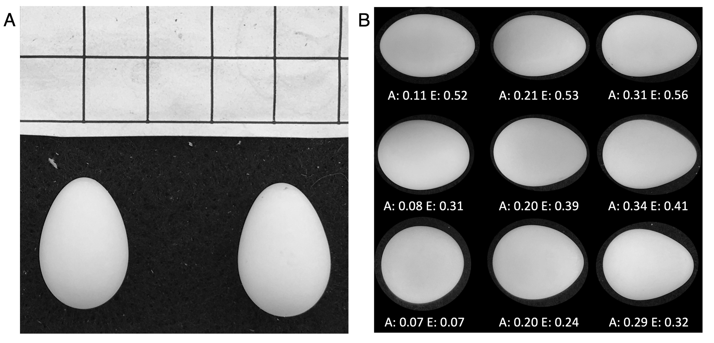

*CCT, TAR, JJU, MNV: Department of Ecology & Evolutionary Biology and Lab of Ornithology, Cornell University*  
*ASI: Odum School of Ecology, University of Georgia*


*Correspondence: Conor Taff; cct63@cornell.edu*  


\newpage
\raggedright

```{r setup, echo = FALSE, include=FALSE}
knitr::opts_chunk$set(echo = TRUE)
pacman::p_load(tidyverse, rptR, DHARMa, lme4, sjPlot, corrplot, Hmisc, xtable, kableExtra, SIBER, magrittr, MuMIn)
```

```{r load-data, echo = FALSE, warning = FALSE, message = FALSE}
# Load the egg data
  d_egg <- read.delim(here::here("1_raw_data/data_by_egg.txt"))

  # correcting for the small parallax issue
    d_egg$len_IJ <- d_egg$len_IJ * (1/1.025)
    d_egg$wid_IJ <- d_egg$wid_IJ * (1/1.025)

# load the capture list data, just a record of every band of females captured in 2019/20/21
  d_capture <- read.delim(here::here("1_raw_data/capture_list.txt"))

# This is just saved for plotting the mean egg shape 
  d_egg_mu <- d_egg %>%
    summarise(Amu = mean(na.omit(A)), Emu = mean(na.omit(E)))

# This is a subset of only egg shapes that come from control nests for looking at nestling fates
  d_control <- subset(d_egg, d_egg$nest_exp != "Color_Stress" &
                      d_egg$nest_exp != "Light" &
                      d_egg$nest_exp != "CortDose" &
                      d_egg$nest_exp != "Carryover" & 
                      d_egg$nest_exp != "Cold_Snap")

# Load cassie stoddard's egg data
          sp_egg <- read.delim(here::here("1_raw_data/stoddard_data.txt"))
          
# wrangling in a different format
    # summarize by year
      d_eggn <- d_egg %>%
        group_by(year, unit_box, fband) %>%
        summarise(mu_A = mean(A), mu_E = mean(E), n = n(), epy = mean(epy_in_nest), sd_A = sd(A), sd_E = sd(E), wpy = mean(wpy_in_nest), knwn = mean(num_pat_knwn))
      d_eggn$pc_epy <- d_eggn$epy / d_eggn$knwn
      #plot(d_eggn$pc_epy, d_eggn$sd_A)
```

Bird eggs come in a wide variety of shapes and recent large-scale studies across species have renewed interest in understanding the factors that generate and maintain this diversity. However, egg shape also varies dramatically within species: among populations, among individuals, and between eggs produced by the same individual. We measured the shape and size of 1382 eggs produced by 205 tree swallows (*Tachycineta bicolor*) in 259 nests with 45 females having eggs measured in two or three years. We found that intra-specific variation in the asymmetry and ellipticity of tree swallow eggs spanned the range of typical egg shapes from 69% of species reported in a recent study of 1400 species. Variation in shape and size was largely explained by individual identity, as characteristics of egg shape and size were repeatable within females even over multiple years. Eggs produced by mothers and their daughters were also similar in size and shape, although with a sample size of only 15 pairs these relationships were not significant. Female mass and structural size were correlated with the size of eggs produced, but not with their shape. Older females produced eggs that were larger, more asymmetrical, and less elliptical; this pattern was driven at least in part by longitudinal changes in egg characteristics as females aged. We found no evidence that any aspect of shape or size that we measured was related to nestling measurements or fate. A complete understanding of avian egg shapes should incorporate variation at multiple scales and we discuss the interpretation of our results in light of recent large-scale comparative studies that focus only on mean species egg shapes.

*Keywords: egg shape; egg size, among individual variation, scale-dependence*

# LAY SUMMARY 

•	Birds’ eggs vary enormously in their shape and size and ornithologists have long been interested in understanding this variation. 

•	Recent studies have renewed interest in this field and shed light on why egg shape varies among species, but they generally don't consider the fact that eggs also vary enormously within species or even within individuals over the course of their lifetime. 

•	We found that the asymmetry and ellipticity of eggs produced by different individual tree swallows resulted in eggs that spanned most of the shapes seen across 1400 species in a recent comparative study. 

•	This variation mostly resulted from differences among individual tree swallows, because shape and size of eggs produced by the same female were repeatable. 

•	We discuss the ways that egg shape might vary across different scales and what our findings mean for interpreting recent studies that compare different species. 


# INTRODUCTION

Birds vary enormously in the shape and size of the eggs they produce and explaining this remarkable variation has been a longstanding goal of ornithologists [e.g., @thompson1908; @preston1969]. Recently, advances in the ease of making accurate measurements of egg shape and the ability to conduct large-scale comparative analyses have led to renewed efforts to understand what factors drive variation in egg shape between species [@stoddard2017; @montgomerie2021; @shatkovska2018; @biggins2018]. Although intraspecific variation in egg shapes has also long been recognized [@preston1969; @romanoff1949], few studies to date have used these newly available tools to examine variation in shape among populations, among individuals, or within individuals of the same species [but see @adamou2018; @banbura2018]. 

Among species, there is general agreement that differences in life history demands and morphology are associated with egg shape variation, though the details of these patterns and their generality across different taxonomic scales is debated [@stoddard2017; @birkhead2019; @stoddard2019; @montgomerie2021]. At the broadest level, much of the variation in egg shape can be explained by phylogenetic history and relative egg size [@stoddard2017; @montgomerie2021]. After accounting for these differences, wing morphology explains additional variation in egg shape [@stoddard2017], possibly due to its association with selection on body shape and mode of locomotion [@montgomerie2021]. Montgomerie et al. [-@montgomerie2021] argue that different aspects of shape are driven by different selection pressures, with elongation being largely associated with anatomical constraints while asymmetry is an adaptation to conditions during the incubation period. More targeted studies on narrower taxonomic scales have also identified other correlates of egg shape, including pelvis shape [@shatkovska2018], climate conditions [@duursma2018], incubation behavior and chick developmental mode [@birkhead2019], nest characteristics [@nagy2019], and egg composition [@deeming2018], among others. Although there are some clear macro-evolutionary patterns, linking these patterns to micro-evolutionary processes that operate within species is challenging [@simons2002] and the mechanisms generating larger scale patterns are often unclear.

Whereas among species variation has received considerable recent research attention, there is also widespread recognition that egg shape varies within species [@adamou2018; @banbura2018]. The causes of this variation are less clear, both because fewer studies measure the shape of many eggs from known individuals over multiple breeding attempts and because it is often unclear how or if explanations for egg shape variation based on among-species life history differences should apply within species or among populations. In some cases, the interspecific correlates of egg shape variation may not be relevant for understanding intraspecific variation. For example, Stoddard et al. [-@stoddard2017] found that aspects of wing morphology are associated with inter-specific variation, yet this variable is unlikely to differ much among individuals within a population (though it might among populations of a species). Similarly, Birkhead et al. [-@birkhead2018] argue that common murre (*Uria aalge*) eggs are shaped to provide stability on sloping ledges, but this mechanism cannot explain the maintenance of variation among individuals in a species that are all selected for nesting on a similar type of substrate. 

If there is an optimal egg shape for different species [@andersson1978; @barta1997] based on differences in life history traits [e.g., @montgomerie2021; @stoddard2017], then what mechanism maintains the substantial variation in egg shape within species where life history and ecology are relatively similar across individuals? Reconciling explanations for variation in egg shape among species with the apparently large variation in egg shape that exists within at least some species requires a careful consideration of the scale over which mechanisms operate and the processes that produce the patterns observed in interspecific comparisons. A recent debate has focused on the general usefulness of comparing egg shape across all species of birds versus within smaller taxonomic groups that have more similar life histories [@birkhead2019; @stoddard2019]. Montgomerie et al. [-@montgomerie2021] show that relationships at the family level can differ in both strength and direction, such that broad comparisons may be subject to Simpson's paradox. This phenomenon occurs when relationships within sub groups disappear or reverse after groups are combined [@simpson1951]. Despite this recognition that scale is an important consideration for understanding inferences about egg shape, heterogeneity in egg shape among populations or individuals has not been explicitly considered in recent comparative studies.

Because phenotypic variation is hierarchically organized [@westneat2015], the same principle of scale-specific inference can be applied to understanding variation in egg shape among populations of a species, individuals within a population, or repeated production of eggs within an individual female. Inferences derived from higher levels can always be subject to Simpson's paradox or ecological fallacies. Recent comparative studies do not investigate the possibility of different drivers of egg shape variation at these levels and typically include only a small number of eggs measurements per species that are averaged for analysis (e.g., Stoddard et al. 2017 and Montgomerie et al. 2021 measured a median of 8 and 3 eggs per species, respectively). There is no guarantee that relationships observed at broader levels (e.g., family level or across all birds) will explain variation among populations or individuals of the same species. A complete understanding of egg shape variation will require a scale-dependent framework [@agrawal2020] that makes predictions that explicitly consider the scale, based on an understanding of the mechanism(s) involved. Analyses at these different levels are complementary, rather than contradictory [@stoddard2019], but at present, very few studies provide even descriptive data on correlates of variation in egg shape within species or individuals [but see @adamou2018; @banbura2018].

In contrast to egg shape, many studies have explored among and within individual variation in egg size, mass, or composition as it relates to maternal effects and nestling outcomes [reviewed in @christians2002; @groothuis2019; @krist2011]. Christians [-@christians2002] comprehensively reviewed studies of individual variation in egg mass and found that the largest egg in a population is typically 1.5 to 2 times larger than the smallest egg. This enormous variation in egg size tends to be both repeatable (generally repeatability above *r* = 0.60) and heritable [generally *h^2^* > 0.50, @christians2002]. Some individual studies demonstrate that egg size changes with dietary supplementation [@ramsay1997; @hogstedt1981], ambient temperature [@nager1992; @whittingham2007], and female age [@croxall1992; @hipfner1997], but the results of these studies are decidedly mixed and the amount of variation in egg size explained is typically small [no more than 10-15%, @christians2002]. Even female mass and size are inconsistently related to egg size variation in these studies [@christians2002]. While egg mass often predicts early life mass and growth of nestlings, it is less clear whether there are long term fitness consequences of initial egg mass [@christians2002; @potti1999]. Given these patterns, it is possible that much of the variation in intra-specific egg shape might be explained by consistent differences in egg mass, but few studies present the data to address this question and the causes of differences in egg mass themselves remain unclear [@christians2002]. Alternatively, variation in egg shape within species might be largely a result of relaxed selection with little direct fitness consequence.

Here, we studied variation in egg shape and size at the among and within individual level in tree swallows (*Tachycineta bicolor*) over three years. Tree swallows are a migratory cavity nesting species with a distribution spanning most of North America. They typically produce clutches containing 4-7 eggs [@winkler2020bna]. While we are not aware of prior studies directly measuring egg shape, a number of previous studies in different populations of tree swallows have documented substantial variation in egg mass [@ardia2006; @wiggins1990; @bitton2006] or yolk characteristics [@whittingham2002]. These differences are sometimes associated with variation in temperature, food availability, or body condition [@ardia2006; @whittingham2007; @pellerin2016], but also appear to be largely attributable to female identity [@wiggins1990]. 

We were initially interested in comparing the degree of variation in egg shape within tree swallows to the degree of variation described among species in comparative studies. If there is generally strong selection for an optimal egg shape matching life history traits, then we expected there would be relatively little variation in shape within tree swallows (i.e., ellipticity or asymmetry), even if there was variation in egg size associated with investment [@ardia2006; @wiggins1990]. Next, our multi-year study allowed us to assess individual repeatability and correlates of egg shape and size both within a clutch and across multiple years. We also took advantage of the fact that some female nestlings returned to breed as adults, which allowed us to compare the shape and size of eggs produced by mothers and their daughters. Finally, we asked whether there was any evidence that variation in egg shape or size was related to nestling morphology or fate. We interpret the correlations that we observed within tree swallows in light of the results of recent comparative studies.

# METHODS

We studied tree swallows breeding near Ithaca, New York from April to July of 2019 to 2021. Tree swallows at this site have been studied continuously since 1984 and we followed well established protocols for general monitoring of breeding activity [@vitousek2018; @winkler2020]. Briefly, we checked all nest boxes every other day during the breeding season to record the timing of the onset of nest building activity, the initiation and completion of egg laying, the timing of hatching and fledging, and the fate of nestlings. This schedule also allowed us to compile accurate information on clutch size and the number of eggs that hatched at each nest, but we did not have information on the laying order of eggs within a nest.

For this study, we visited each nest during the first week of incubation and photographed eggs to measure size and shape (example photographs in Figure \@ref(fig:ex-fig)). Eggs were placed on a flat black surface and photographed from a height of approximately 14 inches. For these photographs, we placed eggs in a relaxed position rather than attempting to set them perfectly horizontal. Biggins et al. [@biggins2018] showed that large and highly pyriform egg measurements differ systematically when photographed in relaxed versus perfectly horizontal posture. However, it is unclear how much this positioning matters for smaller eggs and we planned to compare our measurements to Stoddard et al. [-@stoddard2017], which used relaxed photographs. The potential error in measurements even for large eggs when relaxed is very small relative to between egg shape variation and tree swallow eggs are small enough that the correction would have been nearly impossible to achieve in the field (i.e., we would have needed to adjust one end by < 1mm in height).

During the years of study, many nests at these sites were included in a variety of experiments focused on manipulating environmental stressors [e.g., @injaian2021; @taff2021]. However, all of these experimental manipulations began during mid-incubation, after eggs had been laid and pictures had been taken. We focus primarily on pre-treatment female and egg characteristics in this study, but we also include an analysis of nestling growth and fate from a subset of 55 nests that were not subject to any experimental manipulations (see below).

```{r ex-fig, echo = FALSE, warning = FALSE, message = FALSE, out.width = 475, fig.cap = "Panel A shows an example of a photograph of two eggs from the same clutch with an included scale grid for measurement. Panel B shows measurements of asymmetry and ellipticity produced from EggxTractor software with a selection of tree swallow eggs from this study. Numbers below each egg indicate the asymmetry and ellipticity. Note that eggs are not shown at scale but are rather shown at a similar size with shape maintained for illustration only."}
  
```


Adult females were captured on day 6-8 of incubation between 6 and 10 am Eastern Standard Time. At the time of capture, we took a series of three blood samples and a set of standard morphological measurements that included mass, flattened wing length, and the length of the head plus bill [@vitousek2018]. Any females captured for the first time were banded with a USGS aluminum leg band. Depending on the experiment, females were captured again later in incubation or provisioning and males were captured during provisioning, but those captures occurred after experimental manipulations and the data are not included in this paper.

Nestlings were banded and measured on day 12 after hatching. At this time, we measured mass, wing length, head plus bill length, and took a small blood sample. Following a return visit to experimental nests on day 15, we avoided checking nests to prevent forced fledging until day 24. We did a final nest check to determine fledging fate for each nestling. Individuals not in the nest at this point were considered fledged and we recorded the band numbers from any dead nestlings recovered. Given our sampling strategy, we cannot link individual egg characteristics to individual nestling morphology or fates, but we can explore correlations between average egg and nestling characteristics at the nest level. While nestling characteristics and fates were recorded at every nest, we only included analyses of nests that were not subject to any experimental manipulations.

## Egg measurements

Using the photographs described above, we characterized the size and shape of eggs from each nest. To measure shape, we followed the approach developed by Baker [-@baker2002], which results in measures of the degree of ellipticity (deviation from circularity) and asymmetry (difference in shape of the two egg poles) as decribed in Stoddard et al. [-@stoddard2017]. The measurements were performed using the `EggxTractor` software in MatLab, provided by Stoddard et al. [-@stoddard2017]. While there are a variety of other methods to characterize egg shape that differ slightly, our approach performs well for the range of shapes covered by tree swallow eggs [@stoddard2017] and allowed for a direct comparison with Stoddard et al. [-@stoddard2017]. 

Biggins et al. [-@biggins2018] demonstrates that Preston's method, which describes shape based on elongation, polar asymmetry, and pointedness, is generally slightly more accurate that Baker's, especially for pyriform eggs. We remeasured a subset of our eggs (n = 900) using the script provided in Biggins et al. [@biggins2018]. Our measure of ellipticity was nearly identical to 'elongation' (*R^2^* = 0.98). Asymmetry was positively correlated with both 'polar asymmetry' (*r* = 0.67) and 'pointedness' (*r* = 0.72) and a simple model with both variables explained most of the variation in asymmetry (*R^2^* = 0.79). Given the high similarity between measures and the fact that we were interested in comparing directly with Stoddard et al. [-@stoddard2017], we focus only on the measures derived from `EggxTractor`, but the dataset archived with the paper includes both measurement approaches. 

To characterize the size of eggs, we used ImageJ [@imagej]. We loaded photographs and set a scale using the scale grid that was included in every image. We then used the straight line segment tool to measure the maximum length from pole to pole (egg length) and the maximum egg width for each egg. For our photographs in the field, the scale bar was located on the same surface that the egg was placed on rather than at the mid-line of the egg. This discrepancy created a small parallax issue when scaling eggs, such that linear distance measurements of the egg width and length were 2.5% longer than true values. We corrected for this scale issue in all of our analyzed measurements. The scale does not have any impact on shape measurements, which are scale independent.

It is important to note that we could not link individual eggs to individual nestlings with our methods. Thus, our egg measurements include those of eggs that hatched along with those that did not hatch for any reason. Many species occasionally lay 'runt' eggs or double-yolked eggs that can differ substantially in size and shape. We did not attempt to identify eggs that clearly fell into these categories, but it is possible that a small number of these eggs or otherwise infertile eggs were included in our measurements.

## Data analysis

We initially examined the overall amount of intra-specific variation in egg shape from our study in comparison with the amount of inter-specific variation presented in Stoddard et al. [-@stoddard2017]. For this qualitative comparison, we estimated a 90% ellipse for tree swallow egg shapes based on asymmetry and ellipticity values and determined how many of the 1400 species included in Stoddard et al. [-@stoddard2017] had average egg shapes that fell within this ellipse. We used a 90% ellipse because it described typical tree swallow egg shape without being overly influenced by unusual eggs or including areas of morphospace with very few egg observations. We note that Stoddard et al. [-@stoddard2017], specifically excluded pyriform eggs and represents a non-random sampling of all possible species, so this comparison is meant only as a qualitative description of tree swallow egg shape variation relative to intra-specific variation.

Given the substantial variation in egg shape among individual tree swallows, we next asked whether aspects of egg shape or size were repeatable within a female. We used linear mixed models implemented in the `rptr` package in R [@stoffel2017] to assess repeatability, measured as the intra-class correlation. For each egg characteristic, we fit a model with random effects for nest identity nested within female identity. This allowed us to directly assess the amount of variation in shape explained by the nest and by female identity. Because eggs laid in a nest occur over a few day period we expect that any immediate environmental conditions that directly impact egg size or shape might be captured by that predictor (e.g., temperature or food availability). Since we only had one nest measurement per female in any given year, the intra-class correlation represents overall repeatability for females, including nests between years. Finally, after calculating repeatability, we used a subset of 15 mother-daughter pairs that both had eggs measured to ask whether a female's egg characteristics predicted her daughter's egg characteristics one or more years later. Most tree swallows at our site disperse after their natal year, so the sample size for recruiting nestlings with known mothers was small [@winkler2005].

We next asked whether individual characteristics of females explained variation in egg shape or size. For these questions, we fit a series of four linear mixed models with egg shape (asymmetry, ellipticity) or size (width, length) as the response variable and with female mass, wing length, head plus bill length, and age as predictors. While we recognized that other aspects of morphology (e.g., pelvis size) might be better predictors of egg characteristics, we were limited to the measurements available and merely sought to understand whether any aspects of female morphology jointly predicted egg characteristics. 

We also included age as a categorical predictor of 'first-time breeders' or 'returning breeders' in these models. Female tree swallows have delayed plumage maturation and first time breeders can be identified by their brown plumage regardless of prior capture history [@winkler2020bna]. We included age because older female tree swallows breed earlier, are more likely to survive overwinter, are often considered higher 'quality', and achieve higher seasonal reproductive success [@winkler2020]. Thus, we predicted that if any aspects of female performance and egg characteristics are associated either directly or indirectly then we would see age differences in egg shapes. Finally, each of these models also included a random effect for nest identity nested within female identity (to account for multiple eggs measured from the same nest). The exact age of returning breeders was not always known, but see below for a subsequent analysis comparing only known age birds. We standardized all continuous predictors to a mean of 0 and standard deviation of 1 so that effect sizes are directly comparable. Models were fit with the `lme4` package and model diagnostics were examined with the `DHARMa` package in R to ensure appropriate fits [@bates2015; @hartig2017].

After finding that female age was related to some egg characteristics, we asked whether this pattern might be explained by a longitudinal change in egg characteristics as females age. We used a subset of 29 females that were measured in multiple years and that were initially observed as first time breeders (i.e., known age) to ask whether egg characteristics changed longitudinally within females as they aged using paired *t*-tests for each egg characteristic. We used the full set of observations from 2019 and 2020 to ask whether any egg characteristics predicted the likelihood of returning to breed in the following year (we could not include 2021 females in this analysis because survival to the next year was not known). We compared the average egg characteristics in year 1 for birds that did or did not return in year 2 using t-tests. Returning the following year is not a perfect proxy for survival because adults may occasionally disperse or go undetected, but in this population previous work using the full historical database has shown that dispersal distance in adulthood is generally very small and detection of returning birds is high [@winkler2020]. 

We analyzed within individual covariation in egg characteristics using a subset of 185 females that had at least 5 eggs with complete measurements. Using this subset, we calculated the pairwise correlation and *R^2^* value for each pair of egg characteristics for each individual female and examined the distribution and average value of these correlations across all females. We qualitatively compared the pattern of covariation within females to that observed when using average egg characteristics among females. We examined clutch size in a set of linear mixed models including only nests that had at least 4 eggs to test whether egg size or shape were associated with clutch size.

To ask whether any aspects of egg characteristics were associated with nestling characteristics, we used a subset of 55 nests that were not part of any experiment. For these nests, we calculated the average egg shape and size and fit simple linear models with average nestling morphology (mass, wing, head plus bill) as response variables and with egg shape and size as predictors. For nestling fate, we fit a single model with the number of nestlings that fledged and the number that did not as the binomial response and with the four egg characteristics as predictors. We used average values at a nest level in these analyses because we were not able to link individual egg shape or size measurements with individual nestling characteristics.

All analyses and figures were produced in R version 4.0.2 [@r2020]. The complete set of code and data required to reproduce all analyses and figures is available at https://github.com/cct663/tres_egg_shape and will be permanently archived on Zenodo upon acceptance.

# RESULTS

In total, we measured the shape and size of 1382 eggs produced in 259 nests by 205 unique females. A total of 38 females had eggs measured in two years and 7 females had eggs measured in 3 years. Overall, there was enormous variation in the shape and size of tree swallow eggs. A 90% ellipse drawn based on tree swallow eggs measured in this study included the species average egg shapes for 965 out of 1400 (69%) species reported in Stoddard et al. [-@stoddard2017] (Figure \@ref(fig:summary-plot)). When comparing average egg characteristics among females, the four measures of egg size and shape that we examined were moderately correlated with each other (Table \@ref(tab:cor-table)).

```{r summary-plot, echo = FALSE, message = FALSE, warning = FALSE, fig.width = 4.5, fig.height = 3.5, fig.cap = "Morphospace of tree swallow egg shapes from 1382 measured eggs. Black polygon is the full minimum convex polygon for all tree swallow eggs and black ellipse indicates the region containing 90% of eggs. The red dashed polygon shows the minimum convex polygon for the 1400 species included in Stoddard et al. 2017. Large symbols show the overall average tree swallow egg shape (black diamond) and overall average egg shape across all species (red triangle)."}

sp_egg_hull <- sp_egg %>%
  drop_na() %>%
  slice(chull(Asymmetry, Ellipticity))

d_egg_hull <- d_egg %>%
  filter(A > 0, E > 0) %>%
  slice(chull(A, E))

sp_egg_mu <- sp_egg %>%
  filter(Asymmetry > 0, Ellipticity > 0) %>%
  dplyr::summarise(A_mu = mean(Asymmetry), E_mu = mean(Ellipticity))

# Replicating something like the main plot from Cassie Stoddard's Science paper
  ggplot(data = d_egg, mapping = aes(x = A, y = E)) +
    geom_polygon(data = sp_egg_hull, alpha = 0.2, show.legend = FALSE, fill = "coral3", inherit.aes = FALSE,
             mapping = aes(x = Asymmetry, y = Ellipticity), linetype = "dashed", color = "coral3") +
    #stat_ellipse(data = sp_egg, mapping = aes(x = Asymmetry, y = Ellipticity), inherit.aes = FALSE, 
    #             color = "coral3", linetype = "dashed") +
    geom_polygon(data = d_egg_hull, alpha = 0.1, show.legend = FALSE, fill = "black", color = "black") +
    #geom_point(data = sp_egg, mapping = aes(x = Asymmetry, y = Ellipticity), inherit.aes = FALSE, color = "red", size = 0.7, alpha = 0.5) +
    geom_point(size = 0.6, alpha = 0.4, color = "black") + 
    #xlim(-0.02, 0.505) + 
    #ylim(0.07, 0.75) +
    xlab("Asymmetry") + 
    ylab("Ellipticity") +
    stat_ellipse() +
    #geom_point(data = subset(sp_egg, sp_egg$Species == "Tachycineta bicolor"), mapping = aes(x = Asymmetry, y = Ellipticity), inherit.aes = FALSE, color = "red", shape = 18, size = 3) +
    geom_point(data = d_egg_mu, mapping = aes(x = Amu, y = Emu), shape = 23, size = 3, color = "white", fill = "black", stroke = 1.5) +
    geom_point(data = sp_egg_mu, mapping = aes(x = A_mu, y = E_mu), shape = 24, size = 3, color = "white", fill = "coral3", stroke = 1.5) +
  theme(axis.title = element_text(size = 14), axis.text = element_text(size = 12)) +
  theme_bw() +
  theme(panel.grid.major = element_blank(), panel.grid.minor = element_blank())


# find how many species points are inside the TRES ellipse
  # working from here: https://cran.r-project.org/web/packages/SIBER/vignettes/Points-Inside-Outside-Ellipse.html
    # Y <- d_egg[, c("A", "E")]
    # Y <- na.omit(Y)
    # p <- 0.90 # percentile of ellipse
    # plot(Y[,1], Y[,2])
    # addEllipse(mu, Sigma, p.interval = p, col = "red", lty = 2)
    # mu <- colMeans(Y)
    # Sigma <- cov(Y)
    # 
    # Y2 <- na.omit(sp_egg[, c("Asymmetry", "Ellipticity")])
    # 
    # z_samp <- pointsToEllipsoid(Y2, Sigma, mu)
    # inside_samp <- ellipseInOut(z_samp, p = p)

```

```{r cor-table, echo = FALSE, message = FALSE, warning = FALSE}
  dec <- na.omit(d_egg[, c("fband", "A", "E", "wid_IJ", "len_IJ")])
  dec2 <- dec %>%
    dplyr::group_by(fband) %>%
    dplyr::summarise(Asymmetry = mean(A), Ellipticity = mean(E), Width = mean(wid_IJ), Length = mean(len_IJ))
  #colnames(dec) <- c("Asymmetry", "Ellipticity", "Width", "Length")
  dec2 <- dec2[, c("Asymmetry", "Ellipticity", "Width", "Length")]
  
  eg_cor <- round(cor(dec2), 2)
  eg_cor2 <- rcorr(as.matrix(dec2))
  
  eg_cor[1, ] <- c("", "**<0.001**", "0.74", "**<0.001**")
  eg_cor[2, 2:4] <- c("", "**<0.001**", "**<0.001**")
  eg_cor[3, 3:4] <- c("", "**0.004**")
  eg_cor[4, 4] <- c("")
  
  knitr::kable(eg_cor, align = 'c', format = "simple",
               caption = "Among-individual correlation for each pair of egg characteristics based on the average of each characteristic for each female. Pearson correlation is shown below the diagonal and *P*-value above the diagonal. Correlations that are significant after Bonferroni correction for multiple comparisons are shown in bold.") 
```

\newpage

```{r egg-within, echo = FALSE, message = FALSE, warning = FALSE, fig.height = 4.5, fig.width = 4.5, fig.cap = "The R-squared values for the association between each pair of egg characteristics for among-individual (x-axis) and within-individual (y-axis) comparisons. Diagonal dashed line illustrates a perfect correspondence between the two axes. Abbreviations for point labels are: asymmetry is 'Asym', width is 'Wid', ellipticity is 'Ellip', and length is 'Len'."}

# cut out of revision
# Panel A shows the distribution of Pearson correlation coefficients for within-individual correlations between each pair of egg characteristics. Dashed vertical line indicates no correlation. In each inset plot, the circle is the mean and horizontal line denotes 1 SD above and below the mean. Panel B shows

  #
## Arranging my multipanel plots ended up being quite hard to accomplish in R. The code below produces the actual plots, but 
# I've arranged the panels and labeling outside o R and loaded the plot back in here with those labels as an image.


# # wrangle data
#   d_eggw <- na.omit(d_egg[, c("fband", "A", "E", "len_IJ", "wid_IJ")])
#   dfband <- d_eggw %>%
#     dplyr::group_by(fband) %>%
#     dplyr::summarise(av_A = mean(A, na.rm = TRUE), av_E = mean(E, na.rm = TRUE),
#                      av_len = mean(len_IJ, na.rm = TRUE), av_wid = mean(wid_IJ, na.rm = TRUE),
#                      count = n(), sd_A = sd(A, na.rm = TRUE), sd_E = sd(E, na.rm = TRUE),
#                      sd_len = sd(len_IJ, na.rm = TRUE), sd_wid = sd(wid_IJ, na.rm = TRUE))
#   dew <- plyr::join(d_eggw, dfband, "fband", "left")
# 
#   dew$sA <- (dew$A - dew$av_A) / dew$sd_A
#   dew$sE <- (dew$E - dew$av_E) / dew$sd_E
#   dew$sLEN <- (dew$len_IJ - dew$av_len) / dew$sd_len
#   dew$sWID <- (dew$wid_IJ - dew$av_wid) / dew$sd_wid
# 
#   dew2 <- subset(dew, dew$count > 4)
#   #ggplot(data = dew2, mapping = aes(x = A, y = E, by = as.factor(fband))) +
#   # geom_point() +
#   #  geom_smooth(se = FALSE, method = "lm")
# 
#   df2 <- data.frame(fband = unique(dew2$fband), a_e = NA, a_len = NA, a_wid = NA, e_len = NA, e_wid = NA, len_wid = NA)
#   for(i in 1:nrow(df2)){
#     sub <- subset(dew2, dew2$fband == df2$fband[i])
#     df2$a_e[i] <- cor(sub$A, sub$E)
#     df2$a_len[i] <- cor(sub$A, sub$len_IJ)
#     df2$a_wid[i] <- cor(sub$A, sub$wid_IJ)
#     df2$e_len[i] <- cor(sub$E, sub$len_IJ)
#     df2$e_wid[i] <- cor(sub$E, sub$wid_IJ)
#     df2$len_wid[i] <- cor(sub$len_IJ, sub$wid_IJ)
#   }
# 
#   df3 <- df2 %>%
#     dplyr::summarise(mu_AE = mean(a_e), sd_AE = sd(a_e),
#                      mu_AL = mean(a_len), sd_AL = sd(a_len),
#                      mu_AW = mean(a_wid), sd_AW = sd(a_wid),
#                      mu_EL = mean(e_len), sd_EL = sd(e_len),
#                      mu_EW = mean(e_wid), sd_EW = sd(e_wid),
#                      mu_LW = mean(len_wid), sd_LW = sd(len_wid),
#                      count = n())
#   df3$se_AE <- df3$sd_AE / sqrt(df3$count)
#   df3$se_AL <- df3$sd_AL / sqrt(df3$count)
#   df3$se_AW <- df3$sd_AW / sqrt(df3$count)
#   df3$se_EL <- df3$sd_EL / sqrt(df3$count)
#   df3$se_EW <- df3$sd_EW / sqrt(df3$count)
#   df3$se_LW <- df3$sd_LW / sqrt(df3$count)
# 
#   pAE <- ggplot(data = df2, mapping = aes(x = a_e)) +
#     geom_histogram(bins = 20, alpha = 0.4, fill = "goldenrod") +
#     theme_bw() +
#     coord_cartesian(xlim = c(-1, 1), ylim = c(0, 40)) +
#     theme(panel.grid.minor = element_blank(), panel.grid.major = element_blank()) +
#     geom_vline(xintercept = 0, linetype = "dashed") +
#     theme(axis.title = element_text(size = 12), axis.text = element_text(size = 10)) +
#     xlab("") +
#     ylab("") +
#     geom_segment(data = df3, mapping = aes(y = 1, yend = 1, x = mu_AE - sd_AE, xend = mu_AE + sd_AE), color = "slateblue") +
#     geom_point(data = df3, mapping = aes(x = mu_AE, y = 1), color = "slateblue", size = 3) +
#     theme(plot.margin = unit(c(0, 0.1, 0, 0), "cm"))
# 
#   pAW <- ggplot(data = df2, mapping = aes(x = a_wid)) +
#     geom_histogram(bins = 20, alpha = 0.4, fill = "goldenrod") +
#     theme_bw() +
#     coord_cartesian(xlim = c(-1, 1), ylim = c(0, 40)) +
#     theme(panel.grid.minor = element_blank(), panel.grid.major = element_blank()) +
#     geom_vline(xintercept = 0, linetype = "dashed") +
#     theme(axis.title = element_text(size = 12), axis.text = element_text(size = 10)) +
#     xlab("") +
#     ylab("") +
#     geom_segment(data = df3, mapping = aes(y = 1, yend = 1, x = mu_AW - sd_AW, xend = mu_AW + sd_AW), color = "slateblue") +
#     geom_point(data = df3, mapping = aes(x = mu_AW, y = 1), color = "slateblue", size = 3)  +
#     theme(plot.margin = unit(c(0, 0.1, 0, 0), "cm"))
# 
#   pAL <- ggplot(data = df2, mapping = aes(x = a_len)) +
#     geom_histogram(bins = 20, alpha = 0.4, fill = "goldenrod") +
#     theme_bw() +
#     coord_cartesian(xlim = c(-1, 1), ylim = c(0, 40)) +
#     theme(panel.grid.minor = element_blank(), panel.grid.major = element_blank()) +
#     geom_vline(xintercept = 0, linetype = "dashed") +
#     theme(axis.title = element_text(size = 12), axis.text = element_text(size = 10)) +
#     xlab("") +
#     ylab("") +
#     geom_segment(data = df3, mapping = aes(y = 1, yend = 1, x = mu_AL - sd_AL, xend = mu_AL + sd_AL), color = "slateblue") +
#     geom_point(data = df3, mapping = aes(x = mu_AL, y = 1), color = "slateblue", size = 3) +
#     theme(plot.margin = unit(c(0, 0.1, 0, 0), "cm"))
# 
#   pEL <- ggplot(data = df2, mapping = aes(x = e_len)) +
#     geom_histogram(bins = 20, alpha = 0.4, fill = "goldenrod") +
#     theme_bw() +
#     coord_cartesian(xlim = c(-1, 1), ylim = c(0, 40)) +
#     theme(panel.grid.minor = element_blank(), panel.grid.major = element_blank()) +
#     geom_vline(xintercept = 0, linetype = "dashed") +
#     theme(axis.title = element_text(size = 12), axis.text = element_text(size = 10)) +
#     xlab("") +
#     ylab("") +
#     geom_segment(data = df3, mapping = aes(y = 1, yend = 1, x = mu_EL - sd_EL, xend = mu_EL + sd_EL), color = "slateblue") +
#     geom_point(data = df3, mapping = aes(x = mu_EL, y = 1), color = "slateblue", size = 3) +
#     theme(plot.margin = unit(c(0, 0.1, 0, 0), "cm"))
# 
#   pEW <- ggplot(data = df2, mapping = aes(x = e_wid)) +
#     geom_histogram(bins = 20, alpha = 0.4, fill = "goldenrod") +
#     theme_bw() +
#     coord_cartesian(xlim = c(-1, 1), ylim = c(0, 40)) +
#     theme(panel.grid.minor = element_blank(), panel.grid.major = element_blank()) +
#     geom_vline(xintercept = 0, linetype = "dashed") +
#     theme(axis.title = element_text(size = 12), axis.text = element_text(size = 10)) +
#     xlab("") +
#     ylab("") +
#     geom_segment(data = df3, mapping = aes(y = 1, yend = 1, x = mu_EW - sd_EW, xend = mu_EW + sd_EW), color = "slateblue") +
#     geom_point(data = df3, mapping = aes(x = mu_EW, y = 1), color = "slateblue", size = 3) +
#     theme(plot.margin = unit(c(0, 0.1, 0, 0), "cm"))
# 
#   pLW <- ggplot(data = df2, mapping = aes(x = len_wid)) +
#     geom_histogram(bins = 20, alpha = 0.4, fill = "goldenrod") +
#     theme_bw() +
#     coord_cartesian(xlim = c(-1, 1), ylim = c(0, 40)) +
#     theme(panel.grid.minor = element_blank(), panel.grid.major = element_blank()) +
#     geom_vline(xintercept = 0, linetype = "dashed") +
#     theme(axis.title = element_text(size = 12), axis.text = element_text(size = 10)) +
#     xlab("") +
#     ylab("") +
#     geom_segment(data = df3, mapping = aes(y = 1, yend = 1, x = mu_LW - sd_LW, xend = mu_LW + sd_LW), color = "slateblue") +
#     geom_point(data = df3, mapping = aes(x = mu_LW, y = 1), color = "slateblue", size = 3) +
#     theme(plot.margin = unit(c(0, 0.1, 0, 0), "cm"))
# 
#   # t.test(df2$a_e, mu = 0, alternative = "two.sided")
#   # t.test(df2$a_len, mu = 0, alternative = "two.sided")
#   # t.test(df2$a_wid, mu = 0, alternative = "two.sided")
#   # t.test(df2$e_len, mu = 0, alternative = "two.sided")
#   # t.test(df2$e_wid, mu = 0, alternative = "two.sided")
#   # t.test(df2$len_wid, mu = 0, alternative = "two.sided")
# 
#   pblank <- ggplot() + theme_void()
# 
#   #ggpubr::ggarrange(pAE, pblank, pblank, pAW, pEW, pblank, pAL, pEL, pLW, nrow = 3, ncol = 3)
#   
# # between individual correlations
#   bAE <- sqrt(r.squaredGLMM(lmer(A ~ E + (1|fband), data = d_egg))[1])
#   bAL <- sqrt(r.squaredGLMM(lmer(A ~ len_IJ + (1|fband), data = d_egg))[1])
#   bAW <- sqrt(r.squaredGLMM(lmer(A ~ wid_IJ + (1|fband), data = d_egg))[1])
#   bEL <- sqrt(r.squaredGLMM(lmer(E ~ len_IJ + (1|fband), data = d_egg))[1])
#   bEW <- -sqrt(r.squaredGLMM(lmer(E ~ wid_IJ + (1|fband), data = d_egg))[1])
#   bLW <- sqrt(r.squaredGLMM(lmer(len_IJ ~ wid_IJ + (1|fband), data = d_egg))[1])
#   
# # within individual correlations
#   # first center measurements within individual
#     d_eggw <- d_egg
#     for(i in 1:nrow(d_eggw)){
#       sub <- subset(d_eggw, d_eggw$fband == d_eggw$fband[i])
#       d_eggw$n[i] <- nrow(subset(sub, sub$A > 0))
#       d_eggw$mu_A[i] <- mean(na.omit(sub$A))
#       d_eggw$mu_E[i] <- mean(na.omit(sub$E))
#       d_eggw$mu_L[i] <- mean(na.omit(sub$len_IJ))
#       d_eggw$mu_W[i] <- mean(na.omit(sub$wid_IJ))
#     }
#     d_eggw <- subset(d_eggw, d_eggw$n > 4)
#     
#     d_eggw$Aw <- d_eggw$A - d_eggw$mu_A
#     d_eggw$Ew <- d_eggw$E - d_eggw$mu_E
#     d_eggw$Lw <- d_eggw$len_IJ - d_eggw$mu_L
#     d_eggw$Ww <- d_eggw$wid_IJ - d_eggw$mu_W
#     
#   # now fit models with the values centered within individual
#       wAE <- sqrt(r.squaredGLMM(lmer(Aw ~ Ew + (1|fband), data = d_eggw))[1])
#       wAL <- sqrt(r.squaredGLMM(lmer(Aw ~ Lw + (1|fband), data = d_eggw))[1])
#       wAW <- sqrt(r.squaredGLMM(lmer(Aw ~ Ww + (1|fband), data = d_eggw))[1])
#       wEL <- sqrt(r.squaredGLMM(lmer(Ew ~ Lw + (1|fband), data = d_eggw))[1])
#       wEW <- -sqrt(r.squaredGLMM(lmer(Ew ~ Ww + (1|fband), data = d_eggw))[1])
#       wLW <- sqrt(r.squaredGLMM(lmer(Lw ~ Ww + (1|fband), data = d_eggw))[1])
# 
# comp_cor <- data.frame(relation = c("AE", "AL", "AW", "EL", "EW", "LW"),
#                        #between = c(0.46, 0.46, 0.02, 0.77, -0.45, 0.20),
#                        #within = c(0.25, 0.11, -0.10, 0.31, -0.64, 0.34),
#                        between = c(bAE, bAL, bAW, bEL, bEW, bLW),
#                        within = c(wAE, wAL, wAW, wEL, wEW, wLW),
#                        rel2 <- c("Asym. vs. Ellip.", "Asym. vs. Len.",
#                                  "Asym. vs. Wid.", "Ellip. vs. Len.",
#                                  "Ellip. vs. Wid.", "Len. vs. Wid."))

# ggplot(data = comp_cor, mapping = aes(x = between^2, y = within^2, label = rel2)) +
#   geom_point(color = "coral3") +
#   coord_cartesian(xlim = c(0, 0.6), ylim = c(0, 0.6)) +
#   geom_abline(slope = 1, intercept = 0, linetype = "dashed") +
#   theme_bw() +
#   theme(panel.grid.minor = element_blank(), panel.grid.major = element_blank()) +
#   theme(axis.text = element_text(size = 12), axis.title = element_text(size = 12)) +
#   ggrepel::geom_label_repel() +
#   xlab(expression(Among-individual~R^{2})) +
#   ylab(expression(Within-individual~R^{2}))
  
```

## Individual repeatability in egg shape and size

```{r rpt-win, echo = FALSE, message = FALSE, warning = FALSE, include = FALSE}
# repeatability of each egg
  rw_asymmetry <- rptGaussian(A ~ 1 + (1|uby) + (1|fband), grname = c("uby", "fband"), data = d_egg, nboot = 500)
  rw_ellip <- rptGaussian(E ~ 1 + (1|uby) + (1|fband), grname = c("uby", "fband"), data = d_egg, nboot = 500)
  rw_len <- rptGaussian(len_IJ ~ 1 + (1|uby) + (1|fband), grname = c("uby", "fband"), data = d_egg, nboot = 500)
  rw_wid <- rptGaussian(wid_IJ ~ 1 + (1|uby) + (1|fband), grname = c("uby", "fband"), data = d_egg, nboot = 500)
```

```{r rpt-btwn, echo = FALSE, warning = FALSE, message = FALSE, include = FALSE}
# wrangle data for between year
  d_egg2 <- d_egg[, c("unit_box", "year", "A", "E", "len_IJ", "wid_IJ", "fband")]
  egg_wide2 <- d_egg2 %>%
      dplyr::group_by(fband, year) %>%
      dplyr::summarise(A = mean(A, na.rm = TRUE), E = mean(E, na.rm = TRUE), 
                len_IJ = mean(len_IJ, na.rm = TRUE), wid_IJ = mean(wid_IJ, na.rm = TRUE),  year = mean(year))

# # calculate repeatability between years
#     rb_asymmetry <- rptGaussian(A ~ 1 + (1|fband), grname = "fband", data = egg_wide2, nboot = 500)
#     rb_ellip <- rptGaussian(E ~ 1 + (1|fband), grname = "fband", data = egg_wide2, nboot = 500)
#     rb_len <- rptGaussian(len_IJ ~ 1 + (1|fband), grname = "fband", data = egg_wide2, nboot = 500)
#     rb_wid <- rptGaussian(wid_IJ ~ 1 + (1|fband), grname = "fband", data = egg_wide2, nboot = 500)
 
# removed from revision   
#Repeatability was higher when considering only the average egg size and shape in different years for females that returned to breed in multiple years (Figure \@ref(fig:btwn-year) A-D; asymmetry *r* = `r round(rb_asymmetry$R[1], 2)`, CI = `r round(rb_asymmetry$CI_emp[1], 2)` to `r round(rb_asymmetry$CI_emp[2], 2)`, *P* < 0.001; ellipticity r = `r round(rb_ellip$R[1], 2)`, CI = `r round(rb_ellip$CI_emp[1], 2)` to `r round(rb_ellip$CI_emp[2], 2)`, *P* < 0.001; egg width r = `r round(rb_wid$R[1], 2)`, CI = `r round(rb_wid$CI_emp[1], 2)` to `r round(rb_wid$CI_emp[2], 2)`, *P* < 0.001; egg length *r* = `r round(rb_len$R[1], 2)`, CI = `r round(rb_len$CI_emp[1], 2)` to `r round(rb_len$CI_emp[2], 2)`, *P* < 0.001).
```

Despite the enormous variation overall, the shape and size of eggs produced by individual females were repeatable. Female identity explained `r round(rw_asymmetry$R[2], 3)*100`% of the variation in egg asymmetry and nest identity explained an additional `r round(rw_asymmetry$R[1], 3)*100`% (female identity 95% CI = `r round(rw_asymmetry$CI_emp[2, 1], 3)*100` to `r round(rw_asymmetry$CI_emp[2, 2], 3)*100`%, *P* < 0.001; nest identity CI = `r round(rw_asymmetry$CI_emp[1, 1], 3)*100` to `r round(rw_asymmetry$CI_emp[1, 2], 3)*100`%, *P* < 0.001). For ellipticity, female identity explained `r round(rw_ellip$R[2], 3)*100`% of the variation and nest identity explained an additional `r round(rw_ellip$R[1], 3)*100`% (female identity 95% CI = `r round(rw_ellip$CI_emp[2, 1], 3)*100` to `r round(rw_ellip$CI_emp[2, 2], 3)*100`%, *P* < 0.001; nest identity CI = `r round(rw_ellip$CI_emp[1, 1], 3)*100` to `r round(rw_ellip$CI_emp[1, 2], 3)*100`%, *P* < 0.001). 

The size of eggs was also repeatable within females. Female identity explained `r round(rw_len$R[2], 3)*100`% of the variation in egg length and nest identity explained an additional `r round(rw_len$R[1], 3)*100`% (female identity 95% CI = `r round(rw_len$CI_emp[2, 1], 3)*100` to `r round(rw_len$CI_emp[2, 2], 3)*100`%, *P* < 0.001; nest identity CI = `r round(rw_len$CI_emp[1, 1], 3)*100` to `r round(rw_len$CI_emp[1, 2], 3)*100`%, *P* < 0.001). Egg width had the lowest repeatability, with female identity explaining `r round(rw_wid$R[2], 3)*100`% of the variation and nest identity explained an additional `r round(rw_wid$R[1], 3)*100`% (female identity 95% CI = `r round(rw_wid$CI_emp[2, 1], 3)*100` to `r round(rw_wid$CI_emp[2, 2], 3)*100`%, *P* < 0.001; nest identity CI = `r round(rw_wid$CI_emp[1, 1], 3)*100` to `r round(rw_wid$CI_emp[1, 2], 3)*100`%, *P* < 0.001)

```{r btwn-year, echo = FALSE, message = FALSE, warning = FALSE, fig.height = 2, fig.width = 8, fig.cap = "Average asymmetry (A), ellipticity (B), egg width (C), and egg length (D) for females that had egg shape measurements in consecutive years."}

# wrangle data to make wide then long version with repeated year observations matched up
          d_egg2 <- d_egg[, c("unit_box", "year", "A", "E", "len_IJ", "wid_IJ", "fband")]
          egg_wide2 <- d_egg2 %>%
              dplyr::group_by(fband, year) %>%
              dplyr::summarize(A = mean(A, na.rm = TRUE), E = mean(E, na.rm = TRUE), 
                        len_IJ = mean(len_IJ, na.rm = TRUE), wid_IJ = mean(wid_IJ, na.rm = TRUE),  year = mean(year)) %>%
              pivot_wider(names_from = year, values_from = c(A, E, len_IJ, wid_IJ))
          
          eggx <- data.frame(fband = rep(egg_wide2$fband, 2),
                             ellip1 = c(egg_wide2$E_2019, egg_wide2$E_2020),
                             ellip2 = c(egg_wide2$E_2020, egg_wide2$E_2021),
                             asym1 = c(egg_wide2$A_2019, egg_wide2$A_2020),
                             asym2 = c(egg_wide2$A_2020, egg_wide2$A_2021),
                             wid1 = c(egg_wide2$wid_IJ_2019, egg_wide2$wid_IJ_2020),
                             wid2 = c(egg_wide2$wid_IJ_2020, egg_wide2$wid_IJ_2021),
                             len1 = c(egg_wide2$len_IJ_2019, egg_wide2$len_IJ_2020),
                             len2 = c(egg_wide2$len_IJ_2020, egg_wide2$len_IJ_2021))
          eggx <- na.omit(eggx)
          

 
# Make two panel plot for asymmetry and ellipticity                   
          p1 <- ggplot(eggx, mapping = aes(x = asym1, y = asym2)) +
            geom_point(col = "black", alpha = 0.6, size = 0.8) + 
            geom_smooth(method = "lm", color = "coral3", fill = "coral3") +
            xlab("Asymmetry year 1") + ylab("Asymmetry year 2") +
            theme_bw() +
            theme(panel.grid.minor = element_blank(), panel.grid.major = element_blank(),
                  axis.title = element_text(size = 12)) +
            annotate(geom = "text", label = "A", x = -Inf, y = Inf, hjust = -0.5, vjust = 1.5, size = 5)
          
          p2 <- ggplot(eggx, mapping = aes(x = ellip1, y = ellip2)) +
            geom_point(col = "black", alpha = 0.6, size = 0.8) + 
            geom_smooth(method = "lm", color = "coral3", fill = "coral3") +
            xlab("Ellipticity year 1") + ylab("Ellipticity year 2") +
            theme_bw() +
            theme(panel.grid.minor = element_blank(), panel.grid.major = element_blank(),
                  axis.title = element_text(size = 12)) +
            annotate(geom = "text", label = "B", x = -Inf, y = Inf, hjust = -0.5, vjust = 1.5, size = 5)
          
          p3 <- ggplot(eggx, mapping = aes(x = wid1, y = wid2)) +
            geom_point(col = "black", alpha = 0.6, size = 0.8) + 
            geom_smooth(method = "lm", color = "coral3", fill = "coral3") +
            xlab("Width year 1 (mm)") + ylab("Width year 2 (mm)") +
            theme_bw() +
            theme(panel.grid.minor = element_blank(), panel.grid.major = element_blank(),
                  axis.title = element_text(size = 12)) +
            annotate(geom = "text", label = "C", x = -Inf, y = Inf, hjust = -0.5, vjust = 1.5, size = 5)
          
          p4 <- ggplot(eggx, mapping = aes(x = len1, y = len2)) +
            geom_point(col = "black", alpha = 0.6, size = 0.8) + 
            geom_smooth(method = "lm", color = "coral3", fill = "coral3") +
            xlab("Length year 1 (mm)") + ylab("Length year 2 (mm)") +
            theme_bw() +
            theme(panel.grid.minor = element_blank(), panel.grid.major = element_blank(),
                  axis.title = element_text(size = 12)) +
            annotate(geom = "text", label = "B", x = -Inf, y = Inf, hjust = -0.5, vjust = 1.5, size = 5)
          
          #ggpubr::ggarrange(p1, p2, p3, p4, nrow = 1)

# old version of these plots ----
        # ggplot(egg_wide2, mapping = aes(x = A_2019, y = A_2020)) +
        #   geom_point(col = "orange") + xlab("Asymmetry year 1") + ylab("Asymmetry year 2") +
        #   geom_smooth(method = "lm", color = "orange", fill = "orange") +
        #   geom_point(color = "slateblue", mapping = aes(x = A_2020, y = A_2021)) +
        #   geom_smooth(method = "lm", color = "slateblue", fill = "slateblue", mapping = aes(x = A_2020, y = A_2021)) +
        #   theme_bw()
        # 
        # ggplot(egg_wide2, mapping = aes(x = E_2019, y = E_2020)) +
        #   geom_point(col = "orange") + xlab("Ellipticity year 1") + ylab("Ellipticity year 2") +
        #   geom_smooth(method = "lm", color = "orange", fill = "orange") +
        #   geom_point(color = "slateblue", mapping = aes(x = E_2020, y = E_2021)) +
        #   geom_smooth(method = "lm", color = "slateblue", fill = "slateblue", mapping = aes(x = E_2020, y = E_2021)) +
        #   theme_bw()
        # 
        # ggplot(egg_wide2, mapping = aes(x = len_IJ_2019, y = len_IJ_2020)) +
        #   geom_point(col = "orange") + xlab("Egg length year 1") + ylab("Egg length year 2") +
        #   geom_smooth(method = "lm", color = "orange", fill = "orange") +
        #   geom_point(color = "slateblue", mapping = aes(x = len_IJ_2020, y = len_IJ_2021)) +
        #   geom_smooth(method = "lm", color = "slateblue", fill = "slateblue", mapping = aes(x = len_IJ_2020, y = len_IJ_2021)) +
        #   theme_bw()
        # 
        # ggplot(egg_wide2, mapping = aes(x = wid_IJ_2019, y = wid_IJ_2020)) +
        #   geom_point(col = "orange") + xlab("Egg width year 1") + ylab("Egg width year 2") +
        #   geom_smooth(method = "lm", color = "orange", fill = "orange") +
        #   geom_point(color = "slateblue", mapping = aes(x = wid_IJ_2020, y = wid_IJ_2021)) +
        #   geom_smooth(method = "lm", color = "slateblue", fill = "slateblue", mapping = aes(x = wid_IJ_2020, y = wid_IJ_2021)) +
        #   theme_bw() + 
        #   coord_cartesian(ylim = c(13.5, 15.5), xlim = c(13, 15.5))

```

When comparing the eggs of mothers and their daughters, there was a positive association between all egg characteristics (Pearson's correlation between mother and daughter for asymmetry *r* = 0.31, *P* = 0.26; ellipticity *r* = 0.28, *P* = 0.31; width *r* = 0.25, *P* = 0.36; length *r* = 0.24, *P* = 0.39). However, with a sample size of only 15 mother and daughter pairs, none of these relationships were significant.

```{r mother-reg, echo = FALSE, warning = FALSE, message = FALSE, fig.height = 4, fig.width = 8, fig.cap = "Average egg asymmetry (A) and ellipticity (B) of recruited female tree swallows banded in our population and that of their previously measured mothers. Lines and shading show simple linear regression and 95% confidence interval for illustration. See text for repeatability estimates."}

d_bird <- d_egg %>%
  group_by(fband) %>%
  summarise(n = n(), mu_A = mean(A), mu_E = mean(E), mu_L = mean(L), mu_T = mean(T), mu_len = mean(len_IJ),
            mu_wid = mean(wid_IJ)) %>%
  plyr::join(d_egg[, c("fband", "gen_mother")], match = "first", type = "left") 

d_recruit <- d_bird %>%
  filter(is.na(gen_mother) == FALSE) 
colnames(d_recruit)[1] <- "recr_band"
colnames(d_recruit)[9] <- "fband"
d_bird2 <- d_bird[, 1:8]
colnames(d_bird2) <- paste(colnames(d_bird2), "moth", sep = "_")
colnames(d_bird2)[1] <- "fband"
d_recruit2 <- plyr::join(d_recruit, d_bird2, "fband")

          p1 <- ggplot(d_recruit2, mapping = aes(x = mu_A, y = mu_A_moth)) +
            geom_point(col = "black", alpha = 0.6) + 
            geom_smooth(method = "lm", color = "coral3", fill = "coral3") +
            xlab("Average egg asymmetry") + ylab("Mother's average egg asymmetry") +
            theme_bw() +
            theme(panel.grid.minor = element_blank(), panel.grid.major = element_blank(),
                  axis.title = element_text(size = 14)) +
            annotate(geom = "text", label = "A", x = -Inf, y = Inf, hjust = -0.5, vjust = 1.5, size = 8)

          p2 <- ggplot(d_recruit2, mapping = aes(x = mu_E, y = mu_E_moth)) +
            geom_point(col = "black", alpha = 0.6) + 
            geom_smooth(method = "lm", color = "coral3", fill = "coral3") +
            xlab("Average egg ellipticity") + ylab("Mother's average egg ellipticity") +
            theme_bw() +
            theme(panel.grid.minor = element_blank(), panel.grid.major = element_blank(),
                  axis.title = element_text(size = 14)) +
            annotate(geom = "text", label = "B", x = -Inf, y = Inf, hjust = -0.5, vjust = 1.5, size = 8)
          
          p3 <- ggplot(d_recruit2, mapping = aes(x = mu_wid, y = mu_wid_moth)) +
            geom_point(col = "black", alpha = 0.6) + 
            geom_smooth(method = "lm", color = "coral3", fill = "coral3") +
            xlab("Average egg width") + ylab("Mother's average egg width") +
            theme_bw() +
            theme(panel.grid.minor = element_blank(), panel.grid.major = element_blank(),
                  axis.title = element_text(size = 14)) +
            annotate(geom = "text", label = "C", x = -Inf, y = Inf, hjust = -0.5, vjust = 1.5, size = 8)
                    
          p4 <- ggplot(d_recruit2, mapping = aes(x = mu_len, y = mu_len_moth)) +
            geom_point(col = "black", alpha = 0.6) + 
            geom_smooth(method = "lm", color = "coral3", fill = "coral3") +
            xlab("Average egg length") + ylab("Mother's average egg length") +
            theme_bw() +
            theme(panel.grid.minor = element_blank(), panel.grid.major = element_blank(),
                  axis.title = element_text(size = 14)) +
            annotate(geom = "text", label = "D", x = -Inf, y = Inf, hjust = -0.5, vjust = 1.5, size = 8)
          
          #ggpubr::ggarrange(p1, p2, p3, p4)

  
```

## Predictors of egg shape and size

In linear mixed models, no aspect of female morphology or age was significantly related to egg asymmetry or ellipticity (Table \@ref(tab:egg-mods)). Female head plus bill length was positively correlated with egg width, while female mass was negatively correlated with egg width (Table \@ref(tab:egg-mods); head plus bill length $\beta$ = 0.08, *P* = 0.01; mass $\beta$ = -0.07, *P* = 0.04). No aspect of female morphology significantly predicted egg length, but older females produced eggs that were both wider and longer (Table \@ref(tab:egg-mods); female age for egg width $\beta$ = 0.24, *P* < 0.001; female age for egg length $\beta$ = 0.24, *P* < 0.02). Despite the fact that age was significantly related to egg width and length and that morphology was significantly related to egg width, the overall amount of variation explained by the fixed effects in these models was low (Table \@ref(tab:egg-mods); egg width full model marginal *R^2^* = 0.04; egg length full model marginal *R^2^* = 0.02). 

Clutch size was unrelated to egg shape (asymmetry $\beta$ = -0.0, CI = -0.01 to 0.0, *P* = 0.88; ellipticity $\beta$ = -0.0, CI = -0.01 to 0.01, *P* = 0.59) or size (width $\beta$ = 0.01, CI = -0.06 to 0.06, *P* = 0.92; length $\beta$ = 0.07, CI = -0.03 to 0.18, *P* = 0.17). 

```{r egg-mods, echo = FALSE, warning = FALSE, message = FALSE}
d_egg$f_age <- as.factor(d_egg$f_age)
d_egg$f_age <- relevel(d_egg$f_age, ref ="SY")
d_egg <- subset(d_egg, d_egg$f_age == "SY" | d_egg$f_age == "ASY")

mA <- lmer(A ~ scale(f_hb1) + scale(f_wing1) + scale(f_mass1) + f_age + (1|fband) + (1|uby), data = d_egg)
mE <- lmer(E ~ scale(f_hb1) + scale(f_wing1) + scale(f_mass1) + f_age + (1|fband) + (1|uby), data = d_egg)
mlen <- lmer(len_IJ ~ scale(f_hb1) + scale(f_wing1) + scale(f_mass1) + f_age + (1|fband) + (1|uby), data = d_egg)
mwid <- lmer(wid_IJ ~ scale(f_hb1) + scale(f_wing1) + scale(f_mass1) + f_age + (1|fband) + (1|uby), data = d_egg)

tm1 <- tab_model(mA, mE, mwid, mlen, show.re.var = FALSE, show.ngroups = FALSE, show.icc = FALSE,
                  pred.labels = c("Intercept", "Headbill", "Wing", "Mass", "Age"),
                  dv.labels = c("Asymmetry", "Ellipticity", "Width", "Length"))

tm <- tab_model(mA, mE, mwid, mlen, show.re.var = FALSE, show.ngroups = FALSE, show.icc = FALSE,
                  pred.labels = c("Intercept", "Headbill", "Wing", "Mass", "Age"),
                  dv.labels = c("Asymmetry", "Ellipticity", "Width", "Length"),
                  file = here::here("5_other_outputs/models.html"))

tmod <- rlist::list.clean(XML::readHTMLTable(here::here("5_other_outputs/models.html")), fun = is.null, recursive = FALSE)
tmod2 <- tmod[[1]] %>% janitor::row_to_names(row_number = 1)
#tmod2 <- as.matrix(tmod2) %>% as_tibble()
tmod2[is.na(tmod2)] <- ""

# I haven't been able to find a great way to convert this directly to pdf so I have a saved output file that I am reading in to
# make a tab delimited text version of table to read in and print with kable

mods <- read.delim(here::here("5_other_outputs/model_table.txt"))
mod_tabs <- knitr::kable(mods, format = "simple", align = "ccrrr", caption = "Linear mixed models with female band and nest included as random effects (*n* = 1353 eggs, 254 nests, 202 females). All continuous predictors are standardized to a mean of 0 and standard deviation of 1.", longtable = FALSE)
add_footnote(mod_tabs, c("asymmetry: marginal R^2^ = 0.01, conditional R^2^ = 0.47", "ellipticity: marginal R^2^ = 0.01, conditional R^2^ = 0.56", "width: marginal R^2^ = 0.02, conditional R^2^ = 0.64", "length: marginal R^2^ = 0.04, conditional R^2^ = 0.32"))


#html2latex::html2pdf(tm)

#knitr::kable(tmod2, format = "simple", caption = "replace with fit model table", align = "c")

#knitr::kable(tmod, caption = "fill")

```

```{r egg-clutch, echo = FALSE, warning = FALSE, message = FALSE}
  dclutch <- d_egg %>%
    dplyr::group_by(uby, fband) %>%
    dplyr::summarise(av_A = mean(A, na.rm = TRUE), av_E = mean(E, na.rm = TRUE), av_wid = mean(wid_IJ, na.rm = TRUE),
                     av_len = mean(len_IJ, na.rm = TRUE), clutch = mean(clutch_size, na.rm = TRUE), count = n(),
                     av_ci = mean(ci_doy, na.rm = TRUE))

  dclutch <- subset(dclutch, dclutch$clutch > 3.5)
  
  # ggplot(data = dclutch, mapping = aes(x = as.factor(clutch), y = av_A)) +
  #   geom_jitter(alpha = 0.6, width = 0.2) +
  #   geom_boxplot(alpha = 0.5, fill = "coral3", outlier.shape = NA)
  # 
  # ggplot(data = dclutch, mapping = aes(x = as.factor(clutch), y = av_E)) +
  #   geom_jitter(alpha = 0.6, width = 0.2) +
  #   geom_boxplot(alpha = 0.5, fill = "coral3", outlier.shape = NA)
  # 
  # ggplot(data = dclutch, mapping = aes(x = as.factor(clutch), y = av_wid)) +
  #   geom_jitter(alpha = 0.6, width = 0.2) +
  #   geom_boxplot(alpha = 0.5, fill = "coral3", outlier.shape = NA)
  # 
  # ggplot(data = dclutch, mapping = aes(x = as.factor(clutch), y = av_len)) +
  #   geom_jitter(alpha = 0.6, width = 0.2) +
  #   geom_boxplot(alpha = 0.5, fill = "coral3", outlier.shape = NA)
  
  mc1 <- lmer(av_A ~ scale(clutch) + (1|fband), data = dclutch)
  mc2 <- lmer(av_E ~ scale(clutch) + (1|fband), data = dclutch)
  mc3 <- lmer(av_wid ~ scale(clutch) + (1|fband), data = dclutch)
  mc4 <- lmer(av_len ~ scale(clutch) + (1|fband), data = dclutch)

```


## Age related changes

The difference in egg size with female age could arise from longitudinal increases in egg size as females age  or from selective survival of females that lay larger eggs. Among females that were measured as both first time breeders and as returning breeders, asymmetry did not change longitudinally, but ellipticity decreased slightly (Figure \@ref(fig:age-change) A-B; paired *t*-test for asymmetry: *t* = -0.34, df = 28, *P* = 0.73; ellipticity: *t* = -2.3, df = 28, *P* = 0.03). Both the width and length of eggs increased significantly from a female's first to second breeding year (Figure \@ref(fig:age-change) C-D; paired *t*-test for width: *t* = 5.31, df = 28, *P* < 0.001; length: *t* = 2.25, df = 28, *P* = 0.03).

```{r age-change, echo = FALSE, message = FALSE, warning = FALSE, fig.height = 3.3, fig.width = 8.5, fig.cap = "Change in average egg shape (A, B) and size (C, D) for females that were observed as one year old first time breeders and again in the subsequent year. Boxes show the mean and interquartile range for each age group and whiskers extend to 1.5 times the interquartile range. Lines connect observations from the same individual. Asterisks denote significant difference between ages."}

d_age <- d_egg %>%
  filter(f_age == "SY" | f_age == "ASY") %>%
  group_by(fband, f_age) %>%
  dplyr::summarise(A_mu = mean(A), E_mu = mean(E), len_mu = mean(len_IJ), wid_mu = mean(wid_IJ)) 
  #pivot_wider(id_cols = fband, names_from = f_age, values_from = c(A_mu, E_mu, len_mu, wid_mu)) %>%
  #filter(!is.na(A_mu_SY), !is.na(A_mu_ASY))

for(i in 1:nrow(d_age)){
  d_age$count[i] <- nrow(subset(d_age, d_age$fband == d_age$fband[i]))
}
d_age <- subset(d_age, d_age$count == 2)

d_age$f_age <- as.factor(d_age$f_age)
d_age$f_age <- relevel(d_age$f_age, ref = "SY")
a1 <- ggplot(data = d_age, mapping = aes(x = f_age, y = A_mu)) +
  geom_boxplot(alpha = 0.8, width = 0.2, outlier.shape = NA, fill = "coral3") +
  geom_line(aes(group = fband), color = "slateblue", alpha = 0.7) +
  theme_bw() +
  theme(panel.grid.major = element_blank(), panel.grid.minor = element_blank()) +
  xlab("Female age") + ylab("Average egg asymmetry") +
  theme(axis.title = element_text(size = 12), axis.text = element_text(size = 10)) +
  annotate(geom = "text", label = "A", x = -Inf, y = Inf, hjust = -0.5, vjust = 1.5, size = 4) +
  scale_x_discrete(labels = c("SY" = "1", "ASY" = "2"))

a2 <- ggplot(data = d_age, mapping = aes(x = f_age, y = E_mu)) +
  geom_boxplot(alpha = 0.8, width = 0.2, outlier.shape = NA, fill = "coral3") +
  geom_line(aes(group = fband), color = "slateblue", alpha = 0.7) +
  theme_bw() +
  theme(panel.grid.major = element_blank(), panel.grid.minor = element_blank()) +
  xlab("Female age") + ylab("Average egg ellipticity") +
  theme(axis.title = element_text(size = 12), axis.text = element_text(size = 10)) +
  annotate(geom = "text", label = "B", x = -Inf, y = Inf, hjust = -0.5, vjust = 1.5, size = 4) +
  scale_x_discrete(labels = c("SY" = "1", "ASY" = "2")) +
  annotate(geom = "text", x = 1.5, y = 0.6, label = "*", size = 7)

a3 <- ggplot(data = d_age, mapping = aes(x = f_age, y = wid_mu)) +
  geom_boxplot(alpha = 0.8, width = 0.2, outlier.shape = NA, fill = "coral3") +
  geom_line(aes(group = fband), color = "slateblue", alpha = 0.7) +
  theme_bw() +
  theme(panel.grid.major = element_blank(), panel.grid.minor = element_blank()) +
  xlab("Female age") + ylab("Average egg width (mm)") +
  theme(axis.title = element_text(size = 12), axis.text = element_text(size = 10)) +
  annotate(geom = "text", label = "C", x = -Inf, y = Inf, hjust = -0.5, vjust = 1.5, size = 4) +
  scale_x_discrete(labels = c("SY" = "1", "ASY" = "2")) +
  annotate(geom = "text", x = 1.5, y = 15.2, label = "*", size = 7)

a4 <- ggplot(data = d_age, mapping = aes(x = f_age, y = len_mu)) +
  geom_boxplot(alpha = 0.8, width = 0.2, outlier.shape = NA, fill = "coral3") +
  geom_line(aes(group = fband), color = "slateblue", alpha = 0.7) +
  theme_bw() +
  theme(panel.grid.major = element_blank(), panel.grid.minor = element_blank()) +
  xlab("Female age") + ylab("Average egg length (mm)") +
  theme(axis.title = element_text(size = 12), axis.text = element_text(size = 10)) +
  annotate(geom = "text", label = "D", x = -Inf, y = Inf, hjust = -0.5, vjust = 1.5, size = 4) +
  scale_x_discrete(labels = c("SY" = "1", "ASY" = "2")) +
  annotate(geom = "text", x = 1.5, y = 21.8, label = "*", size = 7)

ggpubr::ggarrange(a1, a2, a3, a4, nrow = 1)

d_age3 <- d_age %>%
  pivot_wider(id_cols = fband, names_from = f_age, values_from = c("A_mu", "E_mu", "len_mu", "wid_mu")) 

# t.test(d_age3$A_mu_SY, d_age3$A_mu_ASY, paired = TRUE)
# t.test(d_age3$E_mu_SY, d_age3$E_mu_ASY, paired = TRUE)
# t.test(d_age3$wid_mu_SY, d_age3$wid_mu_ASY, paired = TRUE)
# t.test(d_age3$len_mu_SY, d_age3$len_mu_ASY, paired = TRUE)

```


```{r surv-pred, echo = FALSE, message = FALSE, warning = FALSE, fig.height = 3.3, fig.width = 8.5, fig.cap = "Comparison of average egg shape (A, B) and size (C, D) for females that did or did not return to breed in the following year. Boxes show the mean and interquartile range for each group. Points show average egg characteristics for each female. Asterisks denote significant differences between groups."}
# wrangle data
          d_egg2 <- d_egg[, c("unit_box", "year", "A", "E", "len_IJ", "wid_IJ", "fband", "f_age")]
          surv <- d_egg2 %>%
              dplyr::group_by(fband, year, f_age) %>%
              dplyr::summarize(A = mean(A, na.rm = TRUE), E = mean(E, na.rm = TRUE), 
                        len_IJ = mean(len_IJ, na.rm = TRUE), wid_IJ = mean(wid_IJ, na.rm = TRUE),  year = mean(year))
          surv <- subset(surv, surv$year != 2021)
          
          d_cap <- distinct(d_capture)
  # cross check to see if female is captured in the next year
          surv$next_year <- NA
          for(i in 1:nrow(surv)){
            surv$next_year[i] <- nrow(subset(d_cap, d_cap$fband == surv$fband[i] & d_cap$year == surv$year[i] + 1))
          }
          
  # limit to only SY females to account for age (not all ASY are known age)
          surv <- subset(surv, surv$f_age == "SY")    
          
  # compare
      #t.test(subset(surv$A, surv$next_year == 1), subset(surv$A, surv$next_year == 0))
      #t.test(subset(surv$E, surv$next_year == 1), subset(surv$E, surv$next_year == 0))
      #t.test(subset(surv$wid_IJ, surv$next_year == 1), subset(surv$wid_IJ, surv$next_year == 0))
      #t.test(subset(surv$len_IJ, surv$next_year == 1), subset(surv$len_IJ, surv$next_year == 0))
      
  surv$Returned <- NA
  for(i in 1:nrow(surv)){
    if(surv$next_year[i] == 1){surv$Returned[i] <- "Yes"}
    if(surv$next_year[i] == 0){surv$Returned[i] <- "No"}
  }
  surv$Returned <- as.factor(surv$Returned)
  surv$Returned <- relevel(surv$Returned, ref = "Yes")
  
# make plots  
  p1 <- ggplot(data = surv, mapping = aes(x = Returned, y = A)) +
    geom_boxplot(alpha = 0.5, width = 0.5, outlier.shape = NA, fill = "slateblue") + 
    geom_jitter(alpha = 0.6, width = 0.15, size = 0.6) +
    theme_bw() +
    ylab("Average egg asymmetry") +
    theme(panel.grid.major = element_blank(), panel.grid.minor = element_blank()) +
    theme(axis.title = element_text(size = 12), axis.text = element_text(size = 10)) +
    annotate(geom = "text", label = "A", x = -Inf, y = Inf, hjust = -0.5, vjust = 1.5, size = 4) +
  annotate(geom = "text", x = 1.5, y = 0.31, label = "*", size = 7)
    
  p2 <- ggplot(data = surv, mapping = aes(x = Returned, y = E)) +
    geom_boxplot(alpha = 0.5, width = 0.5, outlier.shape = NA, fill = "slateblue") + 
    geom_jitter(alpha = 0.6, width = 0.15, size = 0.6) +
    theme_bw() +
    ylab("Average egg ellipticity") +
    theme(panel.grid.major = element_blank(), panel.grid.minor = element_blank()) +
    theme(axis.title = element_text(size = 12), axis.text = element_text(size = 10)) +
    annotate(geom = "text", label = "B", x = -Inf, y = Inf, hjust = -0.5, vjust = 1.5, size = 4)
  
  p3 <- ggplot(data = surv, mapping = aes(x = Returned, y = wid_IJ)) +
    geom_boxplot(alpha = 0.5, width = 0.5, outlier.shape = NA, fill = "slateblue") + 
    geom_jitter(alpha = 0.6, width = 0.15, size = 0.6) +
    theme_bw() +
    ylab("Average egg width (mm)") +
    theme(panel.grid.major = element_blank(), panel.grid.minor = element_blank()) +
    theme(axis.title = element_text(size = 12), axis.text = element_text(size = 10)) +
    annotate(geom = "text", label = "C", x = -Inf, y = Inf, hjust = -0.5, vjust = 1.5, size = 4) +
  annotate(geom = "text", x = 1.5, y = 15.4, label = "*", size = 7)
  
  p4 <- ggplot(data = surv, mapping = aes(x = Returned, y = len_IJ)) +
    geom_boxplot(alpha = 0.5, width = 0.5, outlier.shape = NA, fill = "slateblue") + 
    geom_jitter(alpha = 0.6, width = 0.15, size = 0.6) +
    theme_bw() +
    ylab("Average egg length (mm)") +
    theme(panel.grid.major = element_blank(), panel.grid.minor = element_blank()) +
    theme(axis.title = element_text(size = 12), axis.text = element_text(size = 10)) +
    annotate(geom = "text", label = "D", x = -Inf, y = Inf, hjust = -0.5, vjust = 1.5, size = 4) +
  annotate(geom = "text", x = 1.5, y = 22, label = "*", size = 7)
  
  #ggpubr::ggarrange(p1, p2, p3, p4, nrow = 1)
  
  # When comparing the average egg characteristics in year 1 for females that did or did not return to our site in year 2, females with more asymmetric eggs were more likely to return the following year (Figure \@ref(fig:surv-pred) A; Welch two sample *t*-test: *t* = 2.67, df = 152, *P* = 0.008). There was no difference in egg ellipticity for females that did or did not return the following year (Figure \@ref(fig:surv-pred) B; *t*-test: *t* = 1.01, df = 160, *P* = 0.31). Females that laid wider and longer eggs in year 1 were more likely to return in year 2 (Figure \@ref(fig:surv-pred) C-D; width: *t* = 2.60, df = 161, *P* = 0.01; length: *t* = 2.90, df = 155, *P* = 0.004).
  
  # text for this block that was cut out of revision
  
  
```

## Nestling characteristics and fate

There was no evidence that nestling mass or size on day 12 was related to any characteristics of egg shape or size at a nest level (linear model for nestling mass: asymmetry $\beta$ = 0.74, *P* = 0.13, ellipticity $\beta$ = 1.99, *P* = 0.34, width $\beta$ = 1.55, *P* = 0.23, length $\beta$ = -2.41, *P* = 0.20; model for head plus bill length: asymmetry $\beta$ = 0.18, *P* = 0.31, ellipticity $\beta$ = 0.55, *P* = 0.47, width $\beta$ = 0.39, *P* = 0.41, length $\beta$ = -0.58, *P* = 0.40; model for wing length: asymmetry $\beta$ = 1.19, *P* = 0.29, ellipticity $\beta$ = -0.93, *P* = 0.85, width $\beta$ = -0.91, *P* = 0.76, length $\beta$ = 1.13, *P* = 0.79). There was also no evidence that any average egg characteristic predicted the likelihood of survival to fledging among these nests (generalized linear model with binomial response: asymmetry $\beta$ = -0.22, *P* = 0.60, ellipticity $\beta$ = 1.92, *P* = 0.14, width $\beta$ = -1.55, *P* = 0.20, length $\beta$ = 2.17, *P* = 0.21).

```{r nest-fate, echo = FALSE, message = FALSE, warning = FALSE}

# wrangle starting with d_control from above
  dc2 <- d_control %>%
      dplyr::group_by(fband, uby) %>%
      dplyr::summarise(year = mean(year, na.rm = TRUE), av_A = mean(A, na.rm = TRUE),
                       av_E = mean(E, na.rm = TRUE), av_len = mean(len_IJ, na.rm = TRUE),
                       av_wid = mean(wid_IJ, na.rm = TRUE), clutch = mean(clutch_size, na.rm = TRUE),
                       mbrood = mean(max_brood, na.rm = TRUE))

# load and wrangle nestling data
  dnest <- read.delim(here::here("1_raw_data/nestling_morph.txt"))
  dnest <- subset(dnest, is.na(dnest$fate_num) == FALSE)
  dnest2 <- dnest %>%
    dplyr::group_by(uby) %>%
    dplyr::summarise(av_mass = mean(mass, na.rm = TRUE), av_bh = mean(bhead, na.rm = TRUE),
                     av_fw = mean(fwing, na.rm = TRUE), fate_cnt = n(), fate_surv = sum(fate_num))
  
# join them
    dc3 <- plyr::join(dc2, dnest2, "uby", type = "left")
    dc3$fate_died <- dc3$fate_cnt - dc3$fate_surv
    
    dc3$av_A <- scale(dc3$av_A)
    dc3$av_E <- scale(dc3$av_E)
    dc3$av_len <- scale(dc3$av_len)
    dc3$av_wid <- scale(dc3$av_wid)
    
# models for nestling morphology
    mn1 <- lm(av_mass ~ av_A + av_E + av_len + av_wid, data = dc3)
    mn2 <- lm(av_bh ~ av_A + av_E + av_len + av_wid, data = dc3)
    mn3 <- lm(av_fw ~ av_A + av_E + av_len + av_wid, data = dc3)

# model for survival
    mn4 <- glm(cbind(fate_surv, fate_died) ~ av_A + av_E + av_len + av_wid, data = dc3, family = "binomial")

```

# DISCUSSION

We found that variation in the shape of eggs from a single population of tree swallows encompassed most of the variation observed in average egg shape across 1400 species [@stoddard2017]. Consistent with prior studies of egg size in many species [@christians2002], most of this variation was attributable to among-individual differences, as we found that egg shape was repeatable within females and stable across multiple years. Although some aspects of egg shape and size increased as females aged and were associated with overwinter survival, we found no conclusive evidence that either egg shape or size was directly related to any aspect of reproductive performance or nestling survival. Because global patterns of egg shape diversity are, ultimately, the consequence of selection operating on variation at the within-species level, our results have implications for understanding the mechanisms and processes that contribute to egg shape variation among species. 

#Despite finding substantial variation in egg shape among females, we found little evidence that these differences were driven by overall morphology or directly related to any important fitness proxies, other than adult female survival. While a great deal is known about egg shape variation among species [@stoddard2017; @montgomerie2021], understanding what generates and maintains variation in egg shape within species is largely an open question. Egg size is highly heritable in many species [@christians2002] and the correlations that we found between egg shape and size among-individuals, it is likely that variation in egg shape is partially genetically determined. It is worth noting that additive genetics could contribute to egg shape directly or to morphological features, such as pelvis shape [@shatkovska2018] that subsequently influence egg shape. It also seems likely that early life developmental conditions might play a strong role in determining egg size and shape throughout the lifetime. Potti [-@potti1999] found that pied flycatcher (*Ficedula hypoleuca*) egg volume as an adult was related to volume of the egg they had hatched from, but after controlling for maternal effects, early life body condition also had a strong effect on the volume of subsequent eggs and this effect persisted throughout the lifetime. This mechanism also suggests that, at least in some cases, associations between egg characteristics and female condition or performance might arise from a shared cause (early life conditions) rather than from a direct consequence of variation in initial egg shape or size. 

In a meta-analysis of 283 studies that examined variation in egg size within species, Krist [-@krist2011] found that egg size is consistently related to hatching success, chick survival, growth rate, condition, and morphology. These effects are strongest early in life, but sometimes persist long after chicks have hatched [@krist2011]. Therefore, even though we found no clear link between egg size and nestlings in our study, it is plausible that the variation in egg size that we detected could have important consequences for fitness under some conditions (e.g., when food is more limited). Prior studies of tree swallows have suggested that egg size has consequences for nestlings [@ardia2006; @bitton2006] and studies in a variety of species demonstrate that female quality or environmental conditions can generate variation in egg size [@kvalnes2013; @kouwenberg2013]. This pattern might also explain the associations that we saw between egg size, survival, and age among females. Variation in individual quality is an important driver of reproductive success in female tree swallows and older females are typically in better body condition and produce more offspring [@winkler2020]. In this case, the association between overwinter survival and egg size might arise because females that are higher quality or in better current condition are able to invest more in large eggs while also maintaining high survival prospects. Because of the within-individual correlations between egg shape and size, changes in overall investment (egg size) between years might have caused the smaller, but still significant, changes in shape that we detected between years. Alternatively, these correlations may be unrelated to reproductive investment *per se* and instead arise as the product of some other constraint that differs as females age, such as changes in abdominal musculature.

One question that our study cannot address is whether tree swallows have an unusually high or a typical amount of intra-specific variation in egg shape. It seems likely that species that experience strong selection for optimal egg shapes would have less between and within-individual variation in the shape of eggs produced as a consequence of consistent selection. For example, if the egg shape of the common murre is optimized to promote stability on a rocky ledge, we might expect very strong selection for the optimal shape, resulting in little variation among individuals [@birkhead2018]. In contrast, tree swallows nest in cavities, produce variable clutch sizes, and have a widespread geographic distribution that results in highly variable climate conditions and resource availability during breeding [@winkler2020; @zimmer2020]. Given this life history, there may be relaxed selection on egg shape and the variation we observed may result as a by-product of selection on more consequential traits, such as morphology or yolk deposition [@ardia2006]. Our study focused on only a single population, but because clutch size and environment vary predictably across the breeding range [@winkler2014; @zimmer2020], subsequent work comparing egg characteristics across different populations would be illuminating.

Large-scale comparative studies that directly address the amount of within species variation in egg shape--in addition to species mean values--also have the potential to demonstrate how selection for optimal egg shape differs across clades. Understanding which species have more or less variable egg shapes would help to clarify why the factors that explain variation in egg shape differ in their explanatory power at different scales [@stoddard2017; @stoddard2019; @montgomerie2021] and why different factors are sometimes correlated with egg shape in particular groups of birds [@birkhead2019]. We suggest that comparative studies should report the values measured from individual eggs rather than only species mean values in data archives [as in @montgomerie2021] along with information on location of the original nest and female identity. For example, if multiple eggs are measured from the same clutch or from different regions of a species range this information should be indicated even when the main analyses presented focus on overall species level differences.

In current databases, some common species have many egg measurements; however, most species are represented by only a few egg measurements that might come from even fewer females from a single population [@stoddard2017; @montgomerie2021]. Given the huge variation in intra-specific egg shape that we identified here, the choice of individuals in these databases could have major impacts on the results. At best, relying only on species averages might add noise to comparative studies, but in some cases failing to account for different patterns of within species variation might also obscure biologically meaningful patterns [e.g., among species differences in the amount of variation in egg shape, @garamszegi2010; @garamszegi2014]. Available egg shape databases are not well designed to fully analyze the hierarchical nature of variation in egg shape, but museum collections house an estimated five million bird eggs around the world [@marini2020] and adding photographs of clutches to measure egg shape to ongoing field studies is a low cost addition, though care must be taken to standardize photography for proper measurement [@biggins2018]. Field studies will be particularly valuable when information about the parents is also collected and when the same individuals are measured repeatedly under different conditions or after experimental manipulations.

## CONCLUSION

The past few years have seen huge advances in our understanding of how and why eggs vary in shape across all birds [@stoddard2017; @montgomerie2021]. However, an understanding of how and why egg shape varies within species and within individuals has not been well integrated with interspecific results. We demonstrate enormous variation in egg shape in tree swallows and suggest that more work is needed to understand whether this pattern is typical and the extent to which intra-specific egg shape variation itself differs among species. These studies are important for two reasons. First, there are interesting biological questions to address in their own right within species about the consequences and causes of egg shape variation. Second, understanding the mechanisms that generate variation in egg shape among individuals and how these mechanisms translate across scales of organization has the potential to clarify when large-scale comparative studies can or cannot adequately explain egg shape variation. A complete understanding of the diversity of eggs will include multi-scale explanations from individuals to all birds.

# ETHICAL NOTE

All of the procedures described were approved by the Cornell University Institutional Animal Care & Use Board (IACUC protocol 2019-0023). Captures and sampling were approved by state and federal permits to MNV.

# ACKNOWLEDGMENTS

We would like to thank the field technicians, graduate students, and postdoctoral scientists who helped with field work during the years of this study including Bashir Ali, Paige Becker, Raquel Castromonte, Navya Chamiraju, David Chang van Oordt, KaiXin Chen, Nicholas Faraco-Hadlock, Zapporah Ellis, Ginny Halterman, Jennifer Houtz, Sungmin Ko, Amanda Lazar, Alex Lee-Papastravos, Sabrina McNew, Colleen Miller, Jabril Mohammed, Natalie Morris, Yusol Park, Monique Pipkin, Olivia Rooney, Bella Somoza, and Cedric Zimmer.

# FUNDING

Research funding was provided by a USDA Hatch Grant, DARPA YFA D17AP00033, and NSF-IOS 1457251 (to MNV).

# AUTHOR CONTRIBUTION STATEMENT

CCT and TAR conceived the study. CCT, TAR, JJU, and ASI collected the field data. CCT measured the photographs, analyzed data, and drafted the manuscript. MNV contributed to funding for the project. All authors provided feedback and editing on the manuscript.

# DATA AVAILABILITY STATEMENT

The complete set of code and data required to reproduce all analyses and figures is available at https://github.com/cct663/tres_egg_shape and will be permanently archived on Zenodo upon acceptance.

# REFERENCES